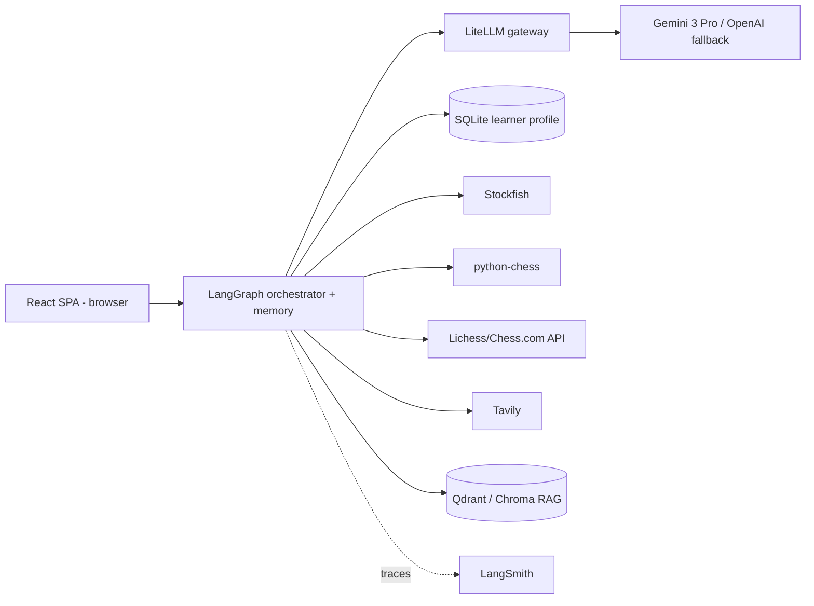

# ♟️ Grandmate

> Turn your online chess games into a plain-English coaching report — grounded in a real engine so
> it never hallucinates, and it remembers your weaknesses across sessions.

**AI Makerspace · Certification Challenge v1.0 submission.**
Give it a Lichess/Chess.com username (or paste a game); it finds every blunder with **Stockfish**,
explains *why* in plain English via **Agentic RAG**, recommends targeted drills, and remembers your
recurring weaknesses so each session builds on the last.

- 🔗 **Live demo:** _add Render URL_ · 🎥 **Loom (≤10 min):** _add link_
- 📄 **Write-up:** [`CAPSTONE_BRIEF.md`](./CAPSTONE_BRIEF.md) · 🏗️ [`ARCHITECTURE.md`](./ARCHITECTURE.md) · 🗺️ [`PLAN.md`](./PLAN.md)

---

## Why
After a loss, players see a centipawn number (`−2.6`) with no explanation. Coaches cost $30–100/hr
and don't scale. This coach translates the engine into *why it was bad and what to do instead*, and
closes the loop by remembering what you keep getting wrong. Full problem statement in
[`CAPSTONE_BRIEF.md`](./CAPSTONE_BRIEF.md).

## Key idea — tool-grounded correctness
The **LLM never analyzes a position.** Every move fact comes from **Stockfish** (evaluation, best
move, principal variation) and **python-chess** (legality); the model only *narrates* verified facts.
A grounding guard re-checks every move it names — so the coach cannot invent lines. This makes it
both trustworthy and **objectively measurable** (0% illegal-move rate in the evals).

## Features
- 🎯 Blunder/mistake/inaccuracy detection with centipawn loss (Stockfish ground truth)
- 💬 Plain-English "why + better plan" grounded in a chess-concept **RAG** corpus
- 🌐 **Agentic search** over public data (Lichess Opening Explorer + Tavily)
- 🧠 **Memory:** per-user learner profile — "last time back-rank was your weak spot…"
- 🧩 Targeted **drills** from the Lichess puzzle database
- 📱 Runs in a browser on **phone and laptop**

## Architecture (at a glance)

Full diagrams and rationale in [`ARCHITECTURE.md`](./ARCHITECTURE.md).

## Tech stack
| Layer | Tool |
|---|---|
| LLM gateway / model | LiteLLM → **Gemini 3 Pro** (OpenAI GPT-4o fallback) |
| Orchestration + memory | LangGraph (+ SQLite learner profile) |
| RAG | OpenAI embeddings + Qdrant (Chroma local) |
| Agent tools | Stockfish, python-chess, Lichess/Chess.com API, Tavily, Puzzle DB |
| Frontend | React + Vite + TypeScript + Tailwind + shadcn/ui |
| Evals | RAGAS + pytest + LLM-as-judge |
| Monitoring | LangSmith |
| Deploy | Docker + Render |

## Quickstart (local)
```bash
git clone <your-repo> && cd grandmate

# Backend (FastAPI) — with uv
cd backend && uv venv && uv pip install -e ".[dev]"
# Stockfish: macOS `brew install stockfish` · Ubuntu `sudo apt-get install stockfish`
cp .env.example .env      # add GEMINI_API_KEY, OPENAI_API_KEY, TAVILY_API_KEY, STOCKFISH_PATH, (QDRANT_URL)
uv run uvicorn app:app --reload      # API → http://localhost:8000

# Frontend (React + Vite) — second terminal
cd frontend && npm install
echo "VITE_BACKEND_URL=http://localhost:8000" > .env
npm run dev                          # UI → http://localhost:5173
```
Then type a username (e.g. `review my games, username hikaru, lichess`) or paste a PGN.

## Environment variables (backend/.env)
```
GEMINI_API_KEY=...            # primary LLM (Google Gemini) via LiteLLM
OPENAI_API_KEY=...            # fallback LLM (OpenAI) via LiteLLM
STOCKFISH_PATH=/usr/games/stockfish
TAVILY_API_KEY=...            # agentic web search
QDRANT_URL=...                # optional; omit to use local Chroma
LANGSMITH_API_KEY=...         # optional tracing
LLM_MODEL=gemini/gemini-3-pro            # LiteLLM primary
LLM_FALLBACK_MODEL=gpt-4o                # LiteLLM fallback
```
`frontend/.env`: `VITE_BACKEND_URL=<backend URL>`

## Evaluation
```bash
uv run python evals/generate_synthetic.py   # build the labeled detection set
uv run pytest evals/ -q                     # detection, grounding, RAG quality
uv run python evals/report.py               # writes evals/report.json
```
| Metric | Target |
|---|---|
| Detection F1 (blunders) | ≥ 0.90 |
| Severity accuracy | ≥ 0.85 |
| Illegal / hallucinated move rate | 0% |
| RAGAS faithfulness | ≥ 0.85 |

Retriever comparison (baseline dense vs hybrid + rerank) is in [`CAPSTONE_BRIEF.md`](./CAPSTONE_BRIEF.md) §6.

## Deploy (public URLs)
```bash
# Backend → Render (Docker, bundles Stockfish)
cd backend && docker build -t grandmate-backend .
# Render: New Web Service → Docker → env (GEMINI_API_KEY, OPENAI_API_KEY, TAVILY_API_KEY) → deploy
#   CMD: uvicorn app:app --host 0.0.0.0 --port $PORT

# Frontend → Vercel
cd frontend && npm run build   # deploy to Vercel with VITE_BACKEND_URL = the backend URL
```
See [`PLAN.md`](./PLAN.md) Phase 7 for details.

## Repository layout (frontend/backend separated)
```
backend/               # FastAPI service — ALL logic, engine, keys
  app.py               #   /review, /chat, /health
  src/coach/           #   schemas, ingestion, analysis, rag, tools, agents, memory, graph, report
  data/corpus/         #   RAG source (openings + concept notes)
  tests/               #   per-phase tests (TDD)
frontend/              # UI only — React (Vite+TS) calling VITE_BACKEND_URL (no logic/keys)
evals/                 # shared eval harness + metrics
CAPSTONE_BRIEF.md SUBMISSION.md ARCHITECTURE.md PLAN.md   # challenge docs
```

## Data & credits
- Games: [Lichess API](https://lichess.org/api), [Chess.com Published-Data API](https://www.chess.com/news/view/published-data-api)
- Puzzles/openings: [Lichess Open Database](https://database.lichess.org/), [lichess-org/chess-openings](https://github.com/lichess-org/chess-openings)
- Engine: [Stockfish](https://stockfishchess.org/) · Web search: [Tavily](https://tavily.com/)

## Certification Challenge deliverables → where to find them
| Task | Location |
|---|---|
| T1 Problem/audience + current-state diagram + eval questions | `CAPSTONE_BRIEF.md` §1 |
| T2 Solution + infra + agent diagrams | `CAPSTONE_BRIEF.md` §2, `ARCHITECTURE.md` |
| T3 Chunking + data source + external API | `CAPSTONE_BRIEF.md` §3 |
| T4 Prototype + public deploy | this repo + live URL |
| T5 Evals harness + conclusions | `evals/`, `CAPSTONE_BRIEF.md` §5 |
| T6 Advanced retriever + 2nd improvement | `CAPSTONE_BRIEF.md` §6 |
| T7 Next steps | `CAPSTONE_BRIEF.md` §7 |

---
*Built for the AI Makerspace AI Engineer Certification. Questions: jacob@aimakerspace.io*
