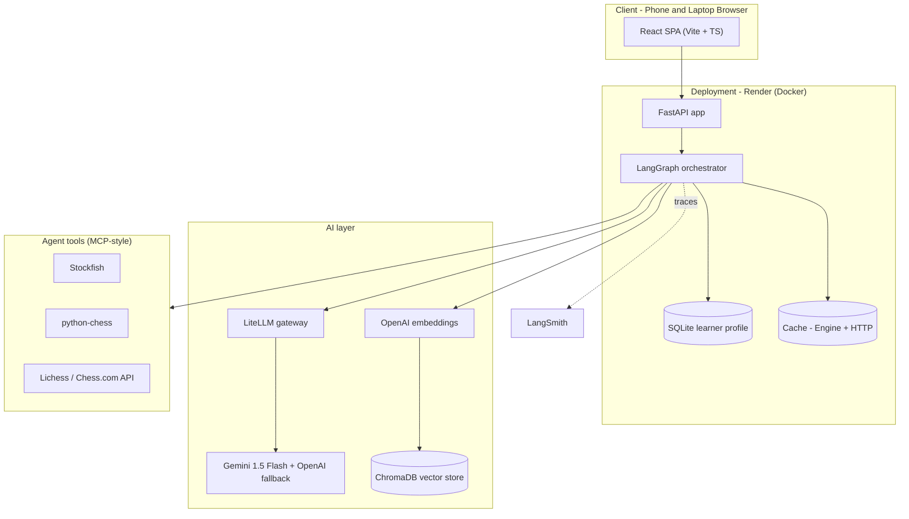
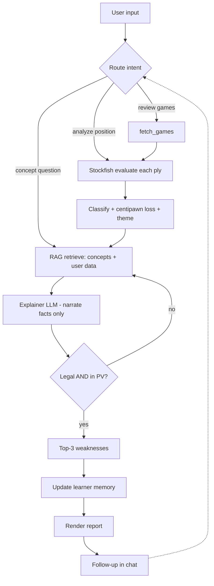
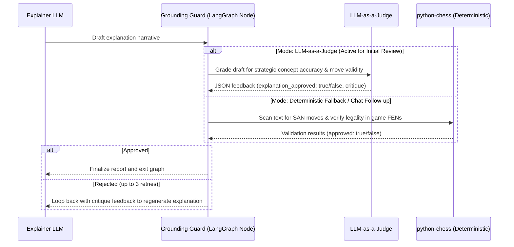
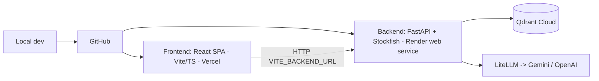

# Architecture — Grandmate

Deep architecture reference for the Certification Challenge build. Pairs with `CAPSTONE_BRIEF.md`
(the graded write-up) and `PLAN.md` (the phased build). Diagrams are GitHub-native Mermaid.

---

## 1. Design principles (the invariants)
1. **Tool-grounded correctness.** The LLM never analyzes a position. Move facts come only from
   Stockfish (evaluation, best move, PV) and python-chess (legality). The LLM *narrates* verified
   facts. A grounding guard re-checks every move the LLM names.
2. **Deterministic core, generative shell.** Detection/classification are deterministic and
   reproducible; only the explanation prose is generative.
3. **Typed contracts at every seam.** Modules exchange Pydantic models, never loose dicts.
4. **Memory is first-class.** A per-user learner profile persists across sessions (required by the
   challenge and the product's whole point).
5. **Browser-first, phone + laptop.** The interface is a hosted responsive web chat.

---

## 2. Component architecture


## 3. Component rationale & tradeoffs

| Component | Choice | Why | Tradeoff / alternative |
|---|---|---|---|
| LLM gateway | LiteLLM | One endpoint, many models, hot-swap for eval | LiteLLM proxy (self-host) if cost/routing control needed |
| LLM | Gemini 1.5 Flash (primary) | Fast reasoning; native to your Antigravity workflow | OpenAI GPT-4o fallback on error |
| Orchestration | LangGraph | Stateful graph + checkpointer = built-in memory | Plain sequential orchestrator (simpler, less flexible) |
| Vector DB | ChromaDB | Embedded local storage, supports BM25 index & vector retrieval | Qdrant hosted alternative |
| Embeddings | `text-embedding-3-small` | Cheap, strong recall | `bge-small` OSS to remove a vendor dependency |
| Engine | Stockfish (Docker) | Free, deterministic ground truth | Lichess Cloud Eval as a fast-path cache |
| Frontend | React + Vite + TS + Tailwind + shadcn/ui | Modern typed SPA; clean FE/BE boundary | Next.js if SSR needed |
| Deploy | Render + Docker + Vercel | Ships the Stockfish binary on Render backend; Vercel hosts frontend React SPA | Fly.io / Railway |
| Monitoring | LangSmith | Native LangGraph tracing + cost metrics | Custom logging |
| Evals | A custom pytest harness + LLM-as-judge | Semantic + deterministic layers | promptfoo / Tau2 for agent-level sims |

## 4. Agent workflow (control flow)


## 5. Data flow & contracts
Ingestion → Analysis → RAG/Explain → Weakness → Drills → Report, each a typed boundary:

```
Game[]  ──►  MoveAnalysis[]  ──►  Explanation[]  ──►  Weakness[] + Drill[]  ──►  CoachReport
(fetch)      (Stockfish)         (RAG + guard)        (aggregate + puzzles)     (render)
```
Full Pydantic definitions live in `PLAN.md` / `src/coach/schemas/models.py`. The key rule: an
`Explanation` is only emitted with `grounded = true` after the legality + PV check.

## 6. Memory design (required component)
Two tiers:
- **Conversation memory** — LangGraph checkpointer keyed by session/thread; enables multi-turn
  follow-ups within a review.
- **Learner profile (durable)** — a SQLite table keyed by `username`:
  ```
  learner_profile(username PK, rating, games_reviewed,
                  weakness_themes JSON,   # rolling counts by theme
                  last_reviewed_at, history JSON)
  ```
  On each review the agent updates rolling theme counts and stores the session summary. On a return
  visit it reads the profile so the coach can say "last time back-rank tactics were your weak spot —
  let's see if it improved." This closes the learning loop the current-state workflow lacks.

## 7. RAG subsystem
- **Corpus:** openings TSV (one opening/chunk), concept notes (one concept/chunk), user-uploaded
  games/notes (one annotated move/chunk). See chunking rationale in `CAPSTONE_BRIEF.md` §3a.
- **Index:** embeddings → Qdrant with per-chunk metadata (`theme`, `source`, `eco`).
- **Baseline retriever:** dense top-k.
- **Advanced retriever (Task 6):** hybrid BM25 + dense, cross-encoder re-rank, theme-metadata
  filter. Evaluated before/after with RAGAS context precision/recall.

## 8. Grounding guard (anti-hallucination & semantic validation)

The application employs a dual-mode **Grounding Guard** integrated as a conditional node in LangGraph to ensure 0% move hallucinations and strategic correctness:



### Validation Modes
1. **Option A: Deterministic Legality Guard (Active / Chat Default)**
   * **Mechanism:** Scans the text using algebraic notation regex: `\b[KQRBN]?[a-h1-8]?x?[a-h][1-8][+#]?\b|O-O(?:-O)?`.
   * **Verification:** Loads each FEN state into a `python-chess.Board` to verify move legality dynamically (~5ms execution latency).
   * **Chat Opt-in:** Enforced on all chat messages to keep response times low while ensuring move legality.
2. **Option B: Semantic Correctness Guard (LLM-as-a-Judge)**
   * **Mechanism:** Queries a secondary LLM node with game context, engine data, and the draft narrative text.
   * **Verification:** The judge LLM verifies the correctness of strategic advice (e.g. ensuring a move is not mislabeled as a "fork" when it's a "pin") and returns a structured JSON approval status.
   * **Fallback:** If the judge API call fails or outputs invalid formatting, the guard automatically falls back to deterministic check to ensure resilience.

### Graph Routing & Debugging
* **LangGraph Feedback Edge:** If validation fails, the graph state incrementing `retry_count` routes the state back to the `narrator_agent` with the critique feedback. If it fails 3 times, it continues to prevent infinite loops.
* **Developer Insights Tracing:** Every grounding attempt is recorded as a `GroundingEvent` in the state's `grounding_log` and rendered in the frontend's **Graph Execution Inspector** under the **🛡️ Grounding** tab.

## 9. Deployment topology (frontend & backend are separate services)

- **MVP:** two deployables — a **backend** (Dockerized FastAPI + Stockfish; holds all logic, keys,
  Qdrant, LiteLLM→Gemini/OpenAI) on **Render**, and a **frontend** (React SPA built with Vite) on
  **Vercel** that calls the backend via `VITE_BACKEND_URL`. Both are public HTTPS on phone + laptop.
- **Later:** enrich the React frontend (board visualizations, eval graphs) — the backend is unchanged.

## 10. Non-functional concerns
- **Latency:** engine analysis dominates → cap depth, cache by FEN+depth, bound games per review,
  analyze plies concurrently within limits.
- **Cost:** gateway + monitoring track $/report; small model for routing/summaries.
- **Guardrails:** input validation, non-chess refusal, kid-appropriate content filter.
- **Reliability:** one un-analyzable ply is logged and skipped, never crashes a report.
- **Secrets:** API keys via environment variables only; never committed.
