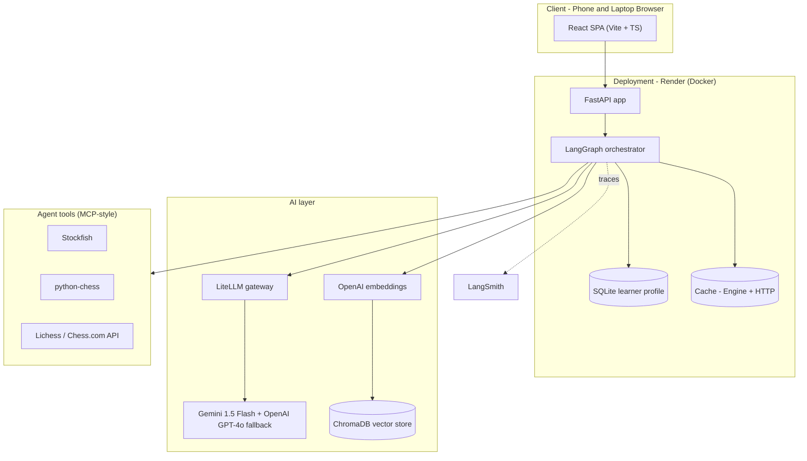
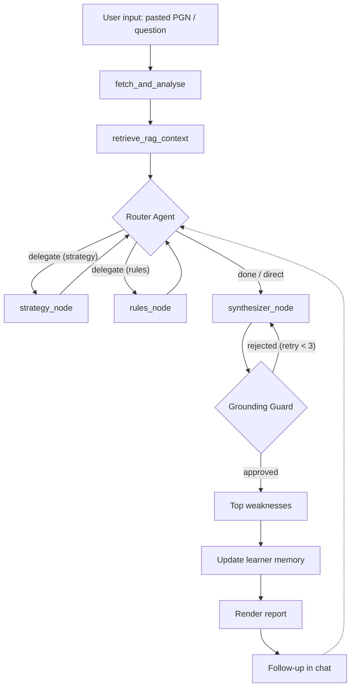
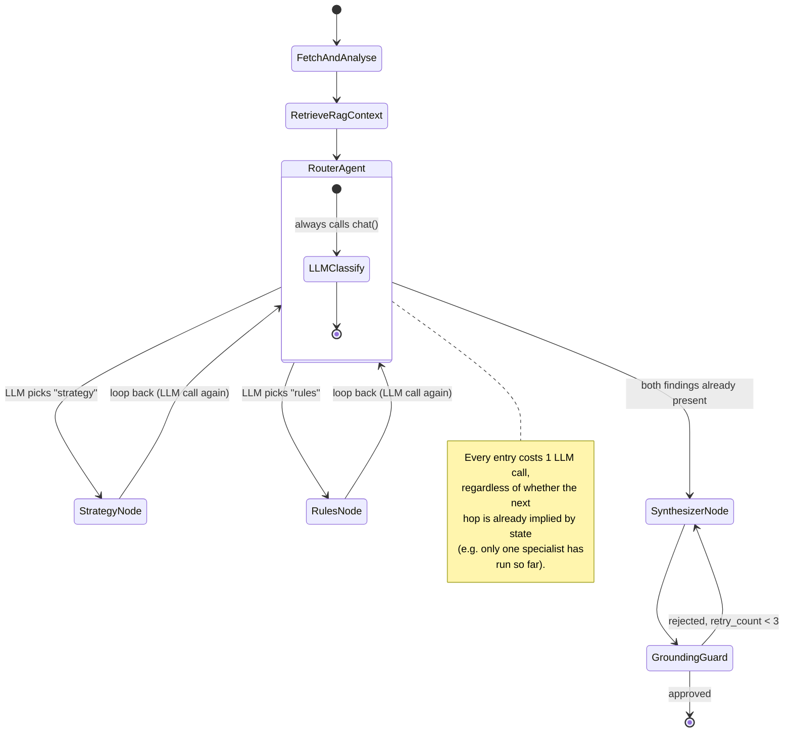
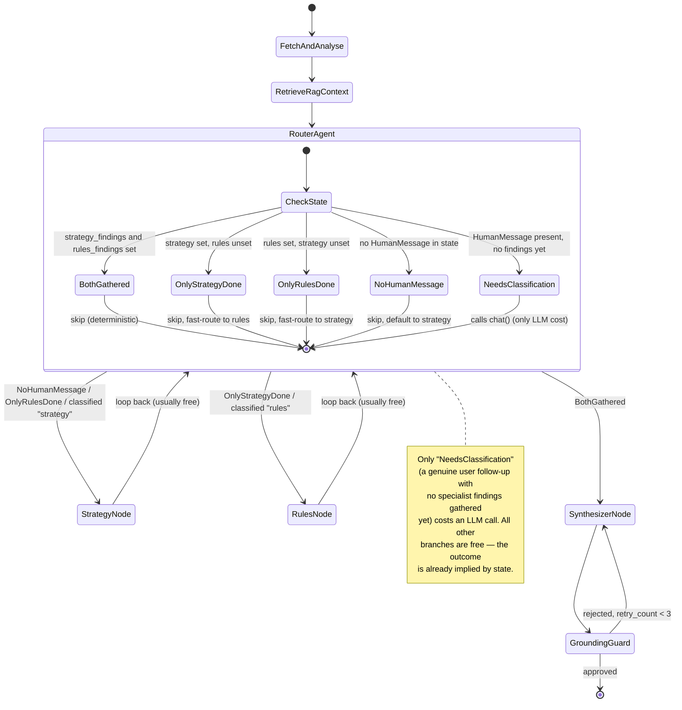
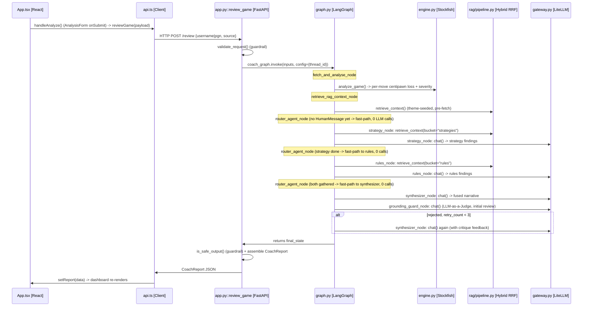
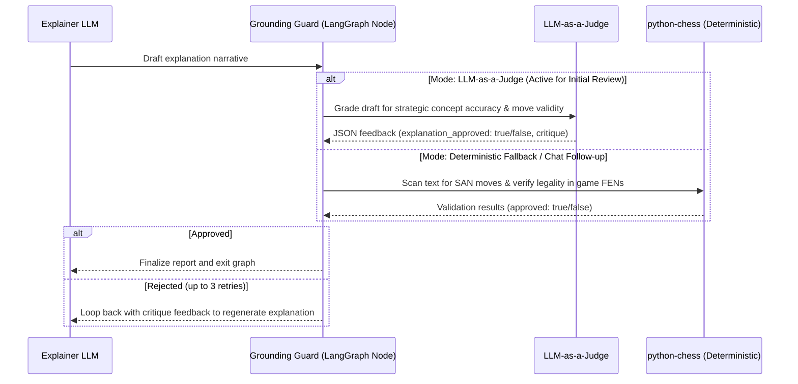
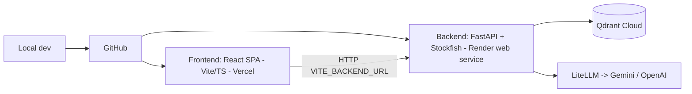

# Architecture — Grandmate

Deep architecture reference for the Certification Challenge build. Pairs with `CAPSTONE_BRIEF.md`
(the graded write-up) and `PLAN.md` (the phased build). Diagrams are GitHub-native Mermaid.

---

## 1. Design principles (the invariants)
1. **Tool-grounded correctness.** The LLM never analyzes a position. Move facts come only from
   Stockfish (evaluation, best move, PV) and python-chess (legality). The LLM *narrates* verified
   facts. A grounding guard re-checks every move the LLM names.
2. **Deterministic core, generative shell.** Detection/classification are deterministic and
   reproducible; only the explanation prose is generative.
3. **Typed contracts at every seam.** Modules exchange Pydantic models, never loose dicts.
4. **Memory is first-class.** Today this means conversation-scoped memory — a LangGraph checkpointer
   that lets a review and its follow-up chat share state. A durable, per-user profile that persists
   across sessions is the intended design and the product's whole point (required by the challenge),
   but it is **not yet built** — see §6 and `Deliverables.md` §8.5.
5. **Browser-first, phone + laptop.** The interface is a hosted responsive web chat.

---

## 2. Component architecture

*(Copy in [`diagrams/component-architecture.md`](diagrams/component-architecture.md).)*

## 3. Component rationale & tradeoffs

| Component | Choice | Why | Tradeoff / alternative |
|---|---|---|---|
| LLM gateway | LiteLLM | One endpoint, many models, hot-swap for eval | LiteLLM proxy (self-host) if cost/routing control needed |
| LLM | Gemini 1.5 Flash (primary, `LLM_MODEL=gemini/gemini-1.5-flash`) | Strong reasoning; native to the Antigravity workflow | OpenAI GPT-4o fallback on error |
| Orchestration | LangGraph | Stateful graph + checkpointer = built-in memory | Plain sequential orchestrator (simpler, less flexible) |
| Vector DB | ChromaDB | Embedded local storage, supports BM25 index & vector retrieval | Qdrant hosted alternative |
| Embeddings | `text-embedding-3-small` | Cheap, strong recall | `bge-small` OSS to remove a vendor dependency |
| Engine | Stockfish (Docker) | Free, deterministic ground truth | Lichess Cloud Eval as a fast-path cache |
| Frontend | React + Vite + TS + Tailwind + shadcn/ui | Modern typed SPA; clean FE/BE boundary | Next.js if SSR needed |
| Deploy | Render + Docker + Vercel | Ships the Stockfish binary on Render backend; Vercel hosts frontend React SPA | Fly.io / Railway |
| Monitoring | LangSmith | Native LangGraph tracing + cost metrics | Custom logging |
| Evals | A custom pytest harness + LLM-as-judge | Semantic + deterministic layers | promptfoo / Tau2 for agent-level sims |

## 4. Agent workflow (control flow)

*(Copy in [`diagrams/agent-workflow.md`](diagrams/agent-workflow.md).)*

**Multi-agent topology.** The single `narrator_agent` was replaced by a **router → specialist →
synthesizer** team: `router_agent_node` classifies intent and delegates, `strategy_node` and
`rules_node` each own one domain and one corpus bucket, and `synthesizer_node` fuses their findings
into the one answer the user reads. Specialists loop back to the router so it can sequence them; the
`should_delegate` conditional edge maps `delegated_specialist` onto the next node.

**Router fast-pathing.** `router_agent_node` decides *deterministically* wherever the outcome is
already implied by state, and only calls the LLM for genuine intent classification:

| Router state | Decision | LLM call |
|---|---|---|
| `strategy_findings` **and** `rules_findings` set | → `synthesizer_node` | none |
| only `strategy_findings` set | → `rules_node` (sequential chaining) | none |
| only `rules_findings` set | → `strategy_node` (sequential chaining) | none |
| no `HumanMessage` in state (initial `/review`) | → `strategy_node` (default) | none |
| `HumanMessage` present, no findings yet (chat follow-up) | classify intent | **1 call** |

**Before: router always calls the LLM.** Every visit to `router_agent` — the first pass on an
initial review, or a loop-back after a specialist finishes — used to invoke the classification LLM
call, even when the next step was already deterministic given current state.



**After: router short-circuits on known state.** `router_agent_node` now inspects
`strategy_findings` / `rules_findings` / whether any `HumanMessage` exists *before* calling the
LLM. Three of its four branches return deterministically with zero LLM cost; only the "user asked
something new, no findings yet" branch reaches the `chat()` call.



**Net effect.** On an initial `/review` (no `HumanMessage` yet), both specialists still run for full
coverage, but the router itself never costs an LLM call — every decision that used to need a
classification call is now made for free from state. On a `/chat` follow-up, the first router visit
still needs the LLM for real intent classification, but the loop-back after the first specialist
finishes is now a free, deterministic hop to the other specialist. Total LLM calls per turn drop by
one in both flows, with no loss of specialist coverage.
*(Copy in [`diagrams/router-fast-pathing.md`](diagrams/router-fast-pathing.md).)*

## 4a. Request lifecycle (end-to-end sequence)
Traces a click in the browser all the way through the FastAPI route, the LangGraph
router/specialist/synthesizer team, Stockfish/RAG, and the LiteLLM gateway, back to the UI — for
both entry points the frontend calls. *(Copy in [`diagrams/request-lifecycle.md`](diagrams/request-lifecycle.md).)*

**Flow A: `POST /review` (initial game analysis).** Router LLM cost: **0 calls** — every routing
decision is implied by state (see the fast-pathing table above); only the specialist/synthesis/guard
nodes call the gateway.



**Flow B: `POST /chat` (follow-up question).** Router LLM cost: **1 call** — the first router visit
does real intent classification; the loop-back after the first specialist is a free, deterministic
hop to the second one.

```mermaid
sequenceDiagram
    participant UI as App.tsx [React]
    participant Client as api.ts [Client]
    participant API as app.py::chat_message [FastAPI]
    participant Graph as graph.py [LangGraph]
    participant RAG as rag/pipeline.py [Hybrid RRF]
    participant GW as gateway.py [LiteLLM]

    UI->>Client: handleSendChat() (ChatPanel onSubmit) -> chatMessage(payload)
    Client->>API: HTTP POST /chat {message, session_id}
    API->>API: validate_request() (guardrail; off-topic -> short-circuit reply)
    API->>Graph: coach_graph.get_state(config={thread_id})
    alt no game loaded in this thread
        API->>Client: {"reply": "Please load and analyze a game first"} (no graph invoke)
    else game loaded
        API->>Graph: coach_graph.invoke({messages:[HumanMessage]}, config)
        Note over Graph: router_agent_node (HumanMessage, no findings yet -> 1 LLM call)
        Graph->>GW: router_agent_node: chat() -> classify "strategy" or "rules"
        Graph->>RAG: delegated specialist: retrieve_context(bucket=...)
        Graph->>GW: delegated specialist: chat() -> findings
        Note over Graph: router_agent_node (one specialist done -> fast-path to the other, 0 calls)
        Graph->>GW: second specialist: chat() -> findings
        Graph->>GW: synthesizer_node: chat() -> fused reply
        Note over Graph: grounding_guard_node forced to deterministic mode (chat follow-up)
        Graph->>API: returns final_state
        API->>API: extract last AIMessage as reply + rebuild DeveloperInsight
        API->>Client: {"reply": ..., "developer_insight": {...}}
    end
    Client->>UI: append reply to conversation
```

## 5. Data flow & contracts
Ingestion → Analysis → RAG/Explain → Weakness → Drills → Report, each a typed boundary:

```
Game[]  ──►  MoveAnalysis[]  ──►  Explanation[]  ──►  Weakness[] + Drill[]  ──►  CoachReport
(fetch)      (Stockfish)         (RAG + guard)        (aggregate themes)        (render)
```
Full Pydantic definitions live in `PLAN.md` / `src/coach/schemas/models.py`. The key rule: an
`Explanation` is only emitted with `grounded = true` after the legality + PV check.

## 6. Memory design (required component)
One tier shipped, one tier still open:
- **Conversation memory (built).** `src/coach/agent/memory.py` wraps a LangGraph `MemorySaver()` —
  an in-process, in-RAM checkpointer keyed by `thread_id` (`review_{username}` or `session_id`). It
  lets a review and its follow-up chat share state within one session, and `/chat` checks
  `coach_graph.get_state()` before invoking the graph, so a message sent to an empty or expired
  thread (e.g. right after a server restart) gets a friendly "please load and analyze a game first"
  reply instead of a 500. **Limitation:** it's a dict in memory, not a database — a server restart
  wipes every thread's state, and a new `thread_id` (a new session, a different day) has no link to
  a user's previous ones.
- **Learner profile (durable, not yet built).** The intended design — a SQLite table keyed by
  `username`, updated with rolling weakness-theme counts after each review and read back in on a
  return visit ("last time back-rank tactics were your weak spot — let's see if it improved") — is
  what would close the learning loop this product is built around. No `learner_profile` table or
  `LearnerProfile` class exists in the code today. Effort estimate and implementation plan tracked
  as `Deliverables.md` §8.5.

## 7. RAG subsystem (Dual-Corpus Bucketed Retriever)
- **Partitioned Corpus**: The corpus is organized into two distinct directories under `backend/data/corpus`:
  * **`rules/`**: Official tournament rules and arbiter regulations, including `FIDE - LawsOfChess.pdf` parsed page-by-page. `pypdf` is declared in `backend/pyproject.toml`, so `load_pdf` ingests the rulebook alongside the markdown notes (175 of the index's 339 chunks).
  * **`strategies/`**: Openings database and general tactical motifs (TSVs row-by-row, markdown by headers).
- **Index**: Embedded locally using ChromaDB with metadata-tagging `{"bucket": "rules"}` or `{"bucket": "strategies"}` for every chunk.
- **Bucketed Retriever**: Updates retrieval functions to accept an optional `bucket` filter. Dense queries apply metadata `where={"bucket": bucket}`. Sparse BM25 queries filter candidate documents prior to scoring, and hybrid RRF fuses results from the filtered subsets to prevent concept bleed.

## 8. Grounding guard (anti-hallucination & semantic validation)

The application employs a dual-mode **Grounding Guard** integrated as a conditional node in LangGraph to ensure 0% move hallucinations and strategic correctness:


*(Copy in [`diagrams/grounding-guard-sequence.md`](diagrams/grounding-guard-sequence.md).)*

### Validation Modes
1. **Option A: Deterministic Legality Guard (Active / Chat Default)**
   * **Mechanism:** Scans the text using algebraic notation regex: `\b[KQRBN]?[a-h1-8]?x?[a-h][1-8][+#]?\b|O-O(?:-O)?`.
   * **Verification:** Loads each FEN state into a `python-chess.Board` to verify move legality dynamically (~5ms execution latency).
   * **Chat Opt-in:** Enforced on all chat messages to keep response times low while ensuring move legality.
2. **Option B: Semantic Correctness Guard (LLM-as-a-Judge)**
   * **Mechanism:** Queries a secondary LLM node with game context, engine data, and the draft narrative text.
   * **Verification:** The judge LLM verifies the correctness of strategic advice (e.g. ensuring a move is not mislabeled as a "fork" when it's a "pin") and returns a structured JSON approval status.
   * **Fallback:** If the judge API call fails or outputs invalid formatting, the guard automatically falls back to deterministic check to ensure resilience.

### Graph Routing & Debugging
* **LangGraph Feedback Edge:** If validation fails, the graph state incrementing `retry_count` routes the state back to the `synthesizer_node` with the critique feedback. If it fails 3 times, it continues to prevent infinite loops.
* **Developer Insights Tracing:** Every grounding attempt is recorded as a `GroundingEvent` in the state's `grounding_log` and rendered in the frontend's **Graph Execution Inspector** under the **🛡️ Grounding** tab.

## 8a. Developer Insights tracing (agent-level observability)
Every node records what it was asked and what it answered, so the whole multi-agent run is
inspectable from the browser without a LangSmith account:
- **`AgentStep`** (`agent_name`, `prompt`, `response`) — appended by each node to the state's
  `agent_steps` list. The `prompt` is the flattened LLM conversation rendered as
  `[ROLE]: content` lines; fast-pathed router visits record a `(Fast-path — …)` /
  `(Skipped — …)` marker instead, which makes the saved LLM call visible on screen.
- **`execution_log`** — a plain-text trail of what each node did (documents retrieved, specialist
  selected, grounding verdict), in execution order.
- Both are carried on the `DeveloperInsight` payload returned by `/review` and `/chat`, and surfaced
  in the frontend **Graph Execution Inspector** (`DevInsights.tsx`), which exposes six tabs:
  **engine · rag · prompt · grounding · agents · logs**.

## 9. Deployment topology (frontend & backend are separate services)

*(Copy in [`diagrams/deployment-topology.md`](diagrams/deployment-topology.md).)*

- **MVP:** two deployables — a **backend** (Dockerized FastAPI + Stockfish; holds all logic, keys,
  Qdrant, LiteLLM→Gemini/OpenAI) on **Render**, and a **frontend** (React SPA built with Vite) on
  **Vercel** that calls the backend via `VITE_BACKEND_URL`. Both are public HTTPS on phone + laptop.
- **Later:** enrich the React frontend (board visualizations, eval graphs) — the backend is unchanged.
- **The image must ship the data.** `backend/data/corpus/` (both buckets) and
  `backend/data/pgn/Carlsen.pgn` are tracked in git and therefore present in the Render build; only
  the generated vector store (`/data/chroma/`) is ignored. A bare `data/` ignore pattern matches at
  every directory level and silently drops the corpus and sample games from the deploy — the backend
  then starts cleanly with no knowledge base at all. `git ls-files backend/data` is the check.

## 10. Non-functional concerns
- **Latency:** engine analysis dominates → cap depth, cache by FEN+depth, bound games per review,
  analyze plies concurrently within limits.
- **Cost:** gateway + monitoring track $/report; small model for routing/summaries.
- **Guardrails:** input validation, non-chess refusal, kid-appropriate content filter.
- **Reliability:** one un-analyzable ply is logged and skipped, never crashes a report.
- **Secrets:** API keys via environment variables only; never committed.
