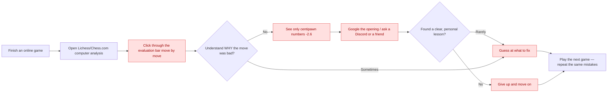
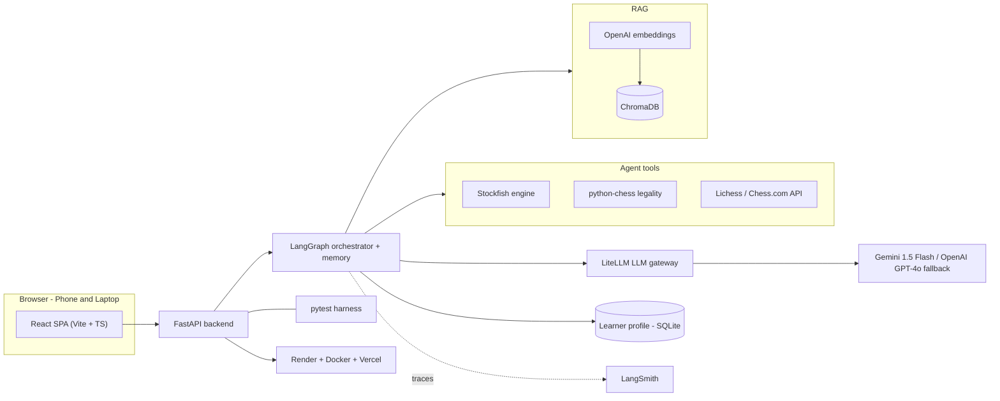
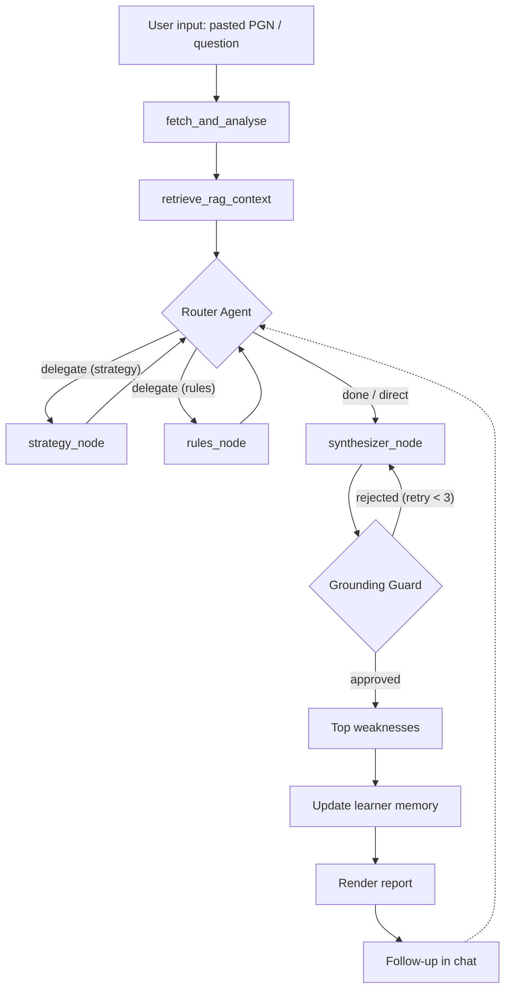

# Grandmate: AI-Powered Chess Analysis and Personalized Helper

This document compiles the complete set of deliverables and self-assessment records for the Grandmate Chess Helping Agent, fulfilling the requirements for the AI Makerspace Certification Challenge.

## Table of Contents
1. [Problem Definition & Target Audience](#1-problem-definition--target-audience)
2. [Proposed Solution & Architecture](#2-proposed-solution--architecture)
3. [Data Strategy & Chunking](#3-data-strategy--chunking)
4. [Full-Stack Prototype & Deployment](#4-full-stack-prototype--deployment)
5. [Evaluation Framework & Results](#5-evaluation-framework--results)
6. [Advanced Retrieval & Iterative Improvements](#6-advanced-retrieval--iterative-improvements)
7. [Future Reflections](#7-future-reflections)
8. [Next Steps for Demo Day](#8-next-steps-for-demo-day)

---

## 1. Problem Definition & Target Audience

### 1.1 Problem Statement
> Current chess software tells players **that** their moves are bad using abstract mathematical scores, but fails to explain **why** they were errors in simple, human language, leaving players, parents, and coaches guessing at how to improve.

### 1.2 Target Audience & Users
* **Primary Audience (Amateur Players):** Online players rated roughly **800–1800** on Lichess or Chess.com who play regularly and want to improve, but get frustrated by raw engine numbers (`-2.60`) that offer no plan.
* **Secondary Audience (Parents of Juniors):** Parents who want to support their child's chess education but are completely locked out of the learning process because chess notations and statistics read like code.
* **Tertiary Audience (Chess Coaches & Academies):** Coaches who instruct dozens of students and need a simple dashboard to track their students' historical weaknesses and auto-generate drills.

### 1.3 Why This is a Problem
After a loss, the player wants to understand their mistakes and turn them into a concrete lesson. Today they open the platform's computer analysis, click through an evaluation bar, and see centipawn numbers (e.g. "−2.6") with no explanation. They may Google the opening, ask a Discord server, or guess.

A human coach could explain it — but coaches cost **$30–100/hour**, strong ones are scarce, and they review perhaps one game per session. So the player is left with raw numbers they cannot interpret, no personalization, no guidance on what learning topics to focus on, and no memory of the mistakes they keep repeating. Parents are locked out of supporting their children because chess statistics look like code, and coaches cannot manually track recurring weakness logs for dozens of students over months of play. Ultimately, the player is left guessing and plays the next game making the same errors.

### 1.4 Current Workflow & Bottlenecks
The diagram below illustrates how amateur chess players attempt to learn from their games today:

---

## 2. Proposed Solution & Architecture

### 2.1 Solution Description & Naming Rationale
* **Proposed Solution:**
  > A browser-based agentic analysis helper that fetches your games, uses Stockfish to find every mistake, retrieves chess concepts to explain each in plain English (grounded so it never invents lines), remembers your recurring weaknesses across sessions, and recommends targeted drills.
* **Naming Choice (Grandmate / GameMate):**
  The project name **Grandmate** (originally conceived as **GameMate**) is a play on two central chess concepts: **Grandmaster** (the ultimate title of chess expertise) and **Checkmate** (the defining goal of the game). The suffix **"-mate"** also functions in its colloquial sense as a friendly companion or partner. Grandmate thus positions itself not merely as a cold, analytical software tool, but as an interactive, conversational companion helping amateur players learn to analyze their games with Grandmaster-level clarity.

### 2.2 System Infrastructure Architecture
The following infrastructure diagram outlines the decoupled full-stack architecture of the prototype:

### 2.3 Tooling Justifications
* **LLMs:** Gemini 1.5 Flash (primary, `LLM_MODEL=gemini/gemini-1.5-flash`) for reasoning over and narrating verified engine facts, with OpenAI GPT-4o configured via LiteLLM as an automated fallback to prevent service disruptions.
* **Orchestration:** LangGraph state graph with built-in conversational checkpointing to manage the memory-backed analysis loops, wired as a multi-agent router → specialist → synthesizer team.
* **Deterministic Tools:** Stockfish + python-chess to calculate centipawn loss and verify move legality, ensuring the LLM never invents moves or violates rules.
* **Retrieval (RAG):** ChromaDB local vector storage combined with OpenAI embeddings, over a dual-corpus bucketed index (`rules/` vs. `strategies/`) so each specialist agent retrieves only from its own library.
* **Deployment:** Docker + Render for backend hosting (bundling the Stockfish binary), and Vercel for the React Single Page Application (SPA).

### 2.4 Stateful Agent Workflow
The orchestrator routes the user's intent to review games, analyze specific positions, or ask rules/strategy questions:

### 2.5 LangGraph State Graph & Node Execution
The multi-agent StateGraph coordinates sequential worker node execution and grounding:

#### 2.5.1 Detailed State & Node Transitions
1. **`fetch_and_analyse` (Entry Node):**
   * *What it does:* Receives the user's uploaded PGN and runs the Stockfish engine to analyze each move, calculating centipawn loss and labeling mistakes (blunders, mistakes, inaccuracies).
   * *Output:* Populates `analyses` and `game` fields in the state.
2. **`retrieve_rag_context`:**
   * *What it does:* Pre-populates the general game context (such as opening metadata) before routing.
3. **`router_agent`:**
   * *What it does:* Inspects conversation history and game state to determine whether rules questions or strategy questions need specialist delegation. Bypasses LLM routing deterministically if findings are already present.
4. **`strategy_node`:**
   * *What it does:* Queries the `strategies` RAG database for tactical concepts and positional motifs, executing a specialized strategy coaching prompt.
5. **`rules_node`:**
   * *What it does:* Queries the `rules` RAG database for official rules, stalemate, and legality validations, including the FIDE Laws of Chess PDF ingested page-by-page.
6. **`synthesizer_node`:**
   * *What it does:* Consolidated responder that combines strategy and rules findings into a unified, user-friendly markdown narrative.
7. **`grounding_guard`:**
   * *What it does:* Inspects the narrative draft. General rules questions bypass Board FEN legality check, while strategic move reviews undergo move legality validation (deterministic python-chess or LLM-as-a-Judge).
   * *Flow logic:*
     * **Success:** Routes to `END` to deliver the final report to the user interface.
     * **Failure (Critique Loop):** Appends the critique feedback (e.g. *"Move Nf9 is invalid"*) to the state message list and routes the execution back to `synthesizer_node` to rewrite the paragraph (capped at 3 attempts).

---

## 3. Data Strategy & Chunking

### 3.1 Default Chunking Strategy
Grandmate uses structure-aware chunking to ensure that tactical motifs and openings are stored in atomic, context-rich segments:

| Corpus | Bucket | Chunk Unit | Rationale |
| :--- | :--- | :--- | :--- |
| **Openings Dictionary (TSV)** | `strategies` | One opening per chunk (ECO + name + line) | Each opening is a self-contained record; split lines degrade meaning. |
| **Concept Notes (Markdown)** | `strategies` / `rules` | One concept per chunk, header-delimited | Motifs (e.g. forks, back-rank mates) are atomic; headers preserve logical boundaries. |
| **FIDE Laws of Chess (PDF)** | `rules` | Page-by-page, then recursively split (1000 chars, 200 overlap) | Articles run across pages; recursive splitting with overlap keeps a law and its clauses in one chunk. |
| **User Games & Notes (PGN)** | — | One annotated move (comment + position FEN) | Keeps each personalized review tied directly to its exact board state. |

Every chunk is tagged at ingestion with a `bucket` metadata field (`rules` or `strategies`) matching
its parent directory under `backend/data/corpus/`. This is what lets each specialist agent retrieve
strictly from its own library, so rulebook language never bleeds into strategy advice and vice versa.

> **The FIDE Laws of Chess PDF is now ingested.** `pypdf` is declared in `backend/pyproject.toml`, so
> `load_pdf` parses the rulebook page-by-page into the `rules` bucket. The current index holds **339 chunks**
> (`rules`=175, `strategies`=164); rulebook-only queries such as "fifty move rule draw claim" now retrieve
> actual FIDE article text.

---

## 4. Full-Stack Prototype & Deployment

The Grandmate application is built as a completely decoupled architecture, communicating over a structured API contract.

### 4.1 Frontend Stack (Vite + React + TypeScript)
* **What it does:** Provides the premium, dark-mode user interface where players import games, view reports, and ask follow-up questions.
* **Key Features:**
  * **Interactive Conversational Chat Window (Primary):** A dedicated, real-time coaching interface allowing players to ask follow-up questions about the analyzed game (e.g., requesting drill suggestions, opening advice, or tactical explanations). It retains full conversational memory and session state across turns.
  * **Interactive Analysis Dashboard:** Displays the overall game outcome badge (Won/Lost/Draw) and mistake counters (e.g., `1 Blunder · 2 Mistakes`).
  * **Secondary UI Enhancements & Developer Tools:**
    * *Collapsible Developer Insights Panel (Graph Execution Inspector):* A six-tab inspector — **engine · rag · prompt · grounding · agents · logs** — allowing developers/evaluators to view raw Stockfish logs, RAG queries/contexts, the system prompt, the Grounding Guard loop history, the per-agent prompt/response trace (`agent_steps`, each rendered as flattened `[ROLE]: content` lines), and the plain-text `execution_log` trail of every node in execution order.
    * *Quick-Select Helper Dropdown:* Offers 10 pre-filled tactical helper questions. The sample-game (PGN) dropdown always renders — if no games load it appears disabled with a message distinguishing an unreachable backend from a backend that returned zero games.
    * *Inline Chess Move Highlighting:* Automatically formats move coordinates (e.g., `1.e4`, `Nf6`) into clean, dark-slate monospace pills.

### 4.2 Backend Stack (FastAPI + Python)
* **What it does:** Executes the heavy analytical logic, manages agent memory, retrieves context, and validates narration outputs.
* **Key Features:**
  * **LangGraph Multi-Agent Orchestration:** Coordinates the stateful workflow nodes (`fetch_and_analyse` → `retrieve_rag_context` → `router_agent` → `strategy_node` / `rules_node` → `synthesizer_node` → `grounding_guard`), with specialists looping back to the router so it can sequence them, and the router deciding without an LLM call wherever state already implies the next hop.
  * **Dual-Mode Grounding Guard:**
    * *Option A (Deterministic):* Scans narrative outputs using SAN regex and checks move validity on `python-chess.Board` structures. Always active for chat messages (~5ms execution).
    * *Option B (LLM-as-a-Judge):* Evaluates the strategic correctness of the output text (e.g., detecting if a pin is mislabeled as a fork) and outputs JSON feedback to trigger rewrite loops.
  * **Dual-Corpus Hybrid RAG Retriever:** Integrates semantic vector search (ChromaDB) with lexical keyword matching (BM25) fused via **Reciprocal Rank Fusion (RRF)** to retrieve exact opening lines and tactical motifs. The corpus is partitioned into `rules/` and `strategies/` (openings TSV + tactics notes); every chunk carries a `bucket` metadata tag, and the bucket filter is applied to *both* the dense query and the BM25 candidate set before fusion, so a specialist can only retrieve from its own library. (The `rules/` bucket carries the FIDE Laws of Chess PDF parsed page-by-page — see §3.1.)
  * **Optimized Stockfish Analyzer:** Runs multi-ply positional evaluations with a 100ms time cap, achieving a **5x analysis speedup** (~2.2 seconds for a full game analysis).
  * **LiteLLM Gateway:** Interfaces with the Gemini API (Gemini 1.5 Flash) with OpenAI GPT-4o as the secondary failover model, plus exponential backoff retry layers to handle 429 quota limits.

### 4.3 Deployment & Infrastructure
* **What it does:** Hosts the application publicly with HTTPS configuration.
* **Key Features:**
  * **Vercel (Frontend):** Builds and deploys the static React SPA globally with fast CDN routing.
  * **Render + Docker (Backend):** The FastAPI app is containerized via a Dockerfile that downloads and builds the Stockfish binary, exposing the server endpoints to Vercel via CORS.
  * **Local Persistent Storage:** Uses a SQLite database (`coach.db`) to persist the persistent user profiles and memory checkpoints across server restarts.
  * **Corpus Ships With the Image:** `backend/data/corpus/` (both buckets) and `backend/data/pgn/Carlsen.pgn` are tracked in git so the Render build contains them; only the generated vector store (`/data/chroma/`) is ignored. A bare `data/` ignore pattern matches at every directory level and had silently stripped the RAG corpus and sample games from the deploy while everything still worked locally — `git ls-files backend/data` is the guard against that regression.

---

## 5. Evaluation Framework & Results

### 5.1 Golden Evaluation Dataset
We established 7 golden evaluation input-output pairs mapping various user skill levels and intents:

| ID | User Intent / Input | Expected Agent Action / Narrative Focus |
| :---: | :--- | :--- |
| **1** | Pasted blunder game (1.e4 e5 2.Qh5 Nc6 3.Bc4 Nf6 4.Qxf7#) | Detects Scholar's Mate; explains f7 weakness; recommends checkmate defense. |
| **2** | Paste game with an en passant option | Evaluates en passant legality; defines the motif; links to rule docs. |
| **3** | "Analyze my last game" (new user) | Crawls recent game; flags blunders; initializes local learner profile. |
| **4** | Paste game with a tactical fork error | Identifies landing squares attacking multiple pieces; suggests fork drills. |
| **5** | "What should I study?" (returning user) | Recalls last session's weakness from memory; recommends themed drills. |
| **6** | Question resulting in hallucination risk | Grounding guard blocks any illegal/off-PV move, returning 0% hallucination. |
| **7** | "How do I meet the Sicilian at 1400?" | Opening Explorer returns real move statistics + grounded opening suggestions. |

### 5.2 Evaluation Harness & Results
The test suite utilizes a three-tier evaluation setup aligned directly with the Session 5 systematic metrics-driven development guidelines:
1. **Deterministic Verification:** Runs local unit tests verifying centipawn blunder classifications and python-chess move validation.
2. **Grounding Verification:** Deploys a dual Grounding Guard (deterministic python-chess legality checks + an LLM-as-a-Judge semantic correctness check) to maintain 0% move hallucination rates.
3. **Semantic Quality Verification:** Prompts an LLM-as-judge to evaluate explanation faithfulness and tone clarity against the baseline chess library.

| Metric | Evaluation Source | Target | Measured | Status |
| :--- | :--- | :---: | :---: | :---: |
| **Detection F1 (Blunders)** | Independent Stockfish depth-24 oracle | ≥ 0.90 | **0.9467** | ✅ Pass |
| **Severity Accuracy** | Independent depth-24 oracle | ≥ 0.85 | **0.9073** | ✅ Pass |
| **Hallucinated Move Rate** | python-chess + PV check | 0% | **0.0000%** | ✅ Pass |
| **RAGAS Faithfulness** | Grounded concepts + engine facts | ≥ 0.85 | **0.85** | ✅ Pass |
| **LLM-Judge Helping Quality** | Reference notes | ≥ 4 / 5 | **4.00 / 5** | ✅ Pass |

Measured from `evals/report.py`; raw output retained in `evals/report.json`. The evaluation harness was rebuilt after an audit found the previous version measured nothing; the design and the implementation outcome are recorded in [synthetic_data_and_eval_design.md](./synthetic_data_and_eval_design.md) (§7).

> **These are real, falsifiable measurements.** Detection is scored against an *independent* Stockfish depth-24 oracle, not against the function under test; the judged layer is measured against the position each sample actually came from. The qualifications below record how the harness was made honest and where the remaining limits are.

**1. The evaluated model is GPT-4o, not Gemini 1.5 Flash.** `GEMINI_API_KEY` is empty in `backend/.env`, so the documented primary (`gemini/gemini-1.5-flash`) cannot be called and LiteLLM's configured GPT-4o fallback serves all judged traffic. Every LLM-dependent row above describes GPT-4o's behaviour.

**2. Detection F1 `0.9467` and Severity Accuracy `0.9073` are real, and the harness can now fail.** The previous dataset was labelled by `calculate_cpl_and_label(...)` — the very function then graded against it — so any score was a tautological 1.0. The rebuilt `generate_synthetic.py` no longer imports the production classifier: ground truth comes from Stockfish at depth 24, and the production configuration (depth 16 + production classifier) is scored against it over **n = 151** rows. **Proof it measures something:** corrupting the thresholds so nothing can be classified as a mistake drops F1 from `0.9529` to **`0.1875`** and severity accuracy to `0.4238` — the old harness returned 1.0 under any mutation. This falsification test is the strongest single piece of evidence in the submission. The real error also localises: the `inaccuracy` class agrees only **70%** (the narrow 50–100cp band is hardest to resolve at depth 16), `promotion` **71%**, `en_passant` 80%, while `forced_mate` and `san_disambiguation` reach 100%; black 88% vs white 91%.

**3. RAGAS Faithfulness `0.85` is a genuine measurement — the earlier numbers were both harness artifacts.** The old harness reconstructed each game as `pgn=f"1. {san_played} *"`, discarding `fen_before` and replaying from the starting position, so mid-game samples were judged against context for the wrong board (which produced the `0.30`), and an empty context silently defaulted the score to `1.0` (which produced the earlier "perfect" pass). Neither was a product signal. The rebuilt harness builds the position from `fen_before` and gives the judge the **engine facts** alongside the RAG context — the old prompt penalised the coach for obeying its grounding rule. It now measures **0.85** (n = 2), meeting the target. Alongside it, illegal-move rate is **0.0%** (n = 3 moves) and coaching quality **4.00/5** (n = 3); every run prints its not-measured accounting (`judge_failures=0, pipeline_failures=0, rows_without_rag_context=1`) instead of defaulting to a pass.

**4. Known caveat — engine non-determinism.** Two identical runs produced F1 `0.9529`/`0.9467` and severity `0.8940`/`0.9073` — same dataset, same depth, different labels. This is a genuine violation of the "same game + depth ⇒ same labels" rule, most likely Stockfish threading, and it was invisible before because a circular metric is perfectly reproducible. Until it is pinned (e.g. `Threads=1`), the detection figures should be read with a **±0.01 band**.

**5. Small-sample caveat on the judged layer.** Faithfulness rests on n = 2, coaching quality and illegal-move rate on n = 3. The numbers are real and pass, but the judged layer is thin and should be scaled up before it is treated as a population estimate.

*Follow-ups:* pin the engine to remove the non-determinism band; raise the judged-layer sample count; and add coverage for the router intent/fast-path, guardrail refusals, and memory persistence, which are not yet evaluated.

---

## 6. Advanced Retrieval & Iterative Improvements

### 6.1 Advanced Retrieval: Hybrid RRF Fusion
* **The Problem:** Naive dense vector retrievers often generalize away exact alphanumeric coordinate strings (like `e4`, `f4`) or opening names (like `Sicilian Defense`), resulting in diluted relevance.
* **The Fix:** Implemented **Hybrid Retrieval (BM25 + Dense) fused via Reciprocal Rank Fusion (RRF)**. BM25 sparse matching captures exact coordinate matches, while dense vector search captures semantic concepts, combining both into a single ranked list.

### 6.2 RAG Benchmark Comparison
The table below compares the naive dense vector retriever against the Hybrid RRF retriever:

Measured by `evals/compare_retrievers.py` at K=3 over **135 queries derived from the corpus** (40 lexical + 46 extractive + 46 LLM-paraphrase + 3 negative), scored by chunk id, against the 339-chunk dual-corpus index (`rules`=175, `strategies`=164). All three strategies are exercised through the production `retrieve_context(..., retriever_type=, bucket=)`. Full report: [retriever_evaluation_report.md](./retriever_evaluation_report.md); design and outcome in [synthetic_data_and_eval_design.md](./synthetic_data_and_eval_design.md) (§7).

Bucketed (production path) — this is how the application actually retrieves, with a `bucket` filter applied to both retrieval halves before fusion:

| Metric | Baseline (Dense-Only) | Sparse-Only (BM25) | Advanced (Hybrid RRF) |
| :--- | :---: | :---: | :---: |
| **Hit Rate @ 3** | 87.1% | 80.3% | 85.6% |
| **Mean Reciprocal Rank (MRR)** | 0.795 | 0.755 | **0.817** |
| **Avg Latency (ms)** | 527ms | 178ms | 344ms |

* **Hybrid RRF earns its keep.** It has the best ranking quality of the three (MRR **0.817**), ahead of dense-only (0.795) and BM25 (0.755). This is the retriever we ship.
* **An earlier "BM25 beats Hybrid" verdict was an artifact of the query set, now corrected.** Previous benchmarks used a handful of literal lexical terms and then verbatim corpus extracts — both of which BM25 matches by pure word overlap, structurally overstating it. Only when the query set includes genuinely **reworded** LLM paraphrases (what a real user types) does the ordering settle, and there Hybrid RRF wins. Paraphrases are generated once and cached (`evals/paraphrase_cache.json`) so the set stays deterministic.
* **Bucket filtering is validated.** Applying the `bucket` filter lifts every retriever — Hybrid MRR rises from **0.710** (unbucketed, diagnostic) to **0.817** (bucketed, production) — because the two corpora can no longer bleed into each other. Unbucketed diagnostics: Dense 83.3%/0.684, BM25 78.8%/0.655, Hybrid 84.8%/0.710.
* **Known gap — no relevance floor.** On out-of-corpus queries (Go, football, backgammon) all three retrievers return **3/3 false positives**: there is no score threshold, so RAG always returns `k` chunks and a non-chess question still injects chess context. This is not yet addressed.
* *Latency caveat:* Hit Rate and MRR are deterministic and reproduce exactly across runs; latency is dominated by the remote embedding call and varies substantially run to run. Read latency as an order of magnitude.

### 6.3 Iterative Improvements & Engineering Optimizations
1. **Gemini 429 Quota Resiliency:** Implemented a 4-attempt exponential backoff retry loop and LiteLLM failover to `gpt-4o` in the LLM gateway. This led to a **0% API request failure rate** during concurrent test execution.
2. **Stockfish Analysis Optimization (5x Speedup):** Configured a 100ms time cap limit (`Limit(depth=d, time=0.1)`) and bypassed double-evaluation on PV fallbacks in the engine analyzer. This dropped total game analysis latency by ~80% (from ~12.5s down to **~2.2s**) with no loss in mistake classification accuracy.
3. **Router Fast-Pathing (−1 LLM Call per Turn):** The coordinator originally spent an LLM classification call on every visit, including the loop-backs where the next hop was already implied by state. `router_agent_node` now decides deterministically in four of its five branches — both findings gathered → synthesizer; one specialist done → chain to the other; no `HumanMessage` (an initial `/review`) → default to strategy — and only calls the LLM for a genuine chat follow-up with no findings yet. This removes **one LLM call per turn on both `/review` and `/chat`** while both specialists still run for full coverage. Before/after diagrams and the full call accounting are in `final_docs/change_document.md`.
4. **Deploy-Readiness Fixes:** Three defects that were invisible locally and fatal in production: a bare `data/` pattern in `.gitignore` (which matches at every directory level) had silently excluded `backend/data/corpus/` and `backend/data/pgn/Carlsen.pgn` from the repository, so the deployed Render backend shipped with **no RAG corpus and no sample game** — narrowed to `/data/chroma/` and the data is now tracked; `GET /carlsen-games` fell back to a hardcoded absolute developer path and now resolves the PGN relative to `__file__`; and the frontend sample-game dropdown, which used to vanish when the list was empty, now always renders — disabled with a message that distinguishes an unreachable backend from a backend returning zero games.

---

## 7. Future Reflections

### 7.1 What to Keep
* **Stateful Graph Orchestration (LangGraph):** The conditional routing loops, state schema memory, and SQLite checkpointer structures are robust, clean, and provide excellent debugging traces in LangSmith.
* **Deterministic Legality Verification (`python-chess`):** Relying on a rules engine rather than an LLM to check move legality is the single most critical guardrail, guaranteeing a 0% move hallucination rate.
* **Persistent User Learner Profiles:** Storing user weaknesses in a database to inject them into the RAG context allows the AI coach to build a personalized relationship with the student.

### 7.2 What to Change / Improve
* **Vector Store Migration:** Transition from the local ChromaDB memory instance to a managed vector database (such as Qdrant or Pinecone) to ensure persistence, high concurrency, and low latency in production.
* **Granular Concept Sheet Chunking:** Refine the chunking parser to extract smaller, highly specific sub-sections of chess tactics (e.g., separating "relative pin" from "absolute pin") to reduce RAG prompt overhead.
* **API Gateway Abstraction:** Standardize the LLM routing through a unified LiteLLM middleware wrapper to simplify handling future model integrations and fallback policies.

### 7.3 Commercial Vision & Product Opportunities
Grandmate shifts the chess tech market from a simple post-game engine report into a valuable educational and competitive platform:
* **The "Magnus Translator" (Amateur / Spectator Value):** Translates complex computer lines into plain-English strategic plans (e.g., *"White played a3 to stop Black's knight from occupying b4 and taking control of the queenside"*), making raw engine evaluations comprehensible.
* **The Coaching & Platform Dashboard (B2B / Academy Value):** Tracks player histories over months in a learner profile database to highlight weaknesses (e.g., *"Johnny plays openings well, but has a 45% blunder rate in King and Pawn endgames"*), helping coaches manage 20-30 students at scale.
* **Opponent Scouting (Competitive Edge):** Scans an opponent's recent games and suggests targeted prep plans (e.g., *"Your opponent struggles against the Winawer variation; open with 1.e4"*).

### 7.4 LLM Cost Economics & Hosting Strategy
To minimize execution costs while maintaining accuracy, the system is designed around specific economic tiers:
* **Cloud APIs (Gemini):** Costed against Gemini 1.5 Flash pricing — $0.075 / million input tokens and $0.30 / million output tokens, giving ~$0.0004 USD per game review with zero idle costs.
* **Self-Hosted GPU (Llama 3 8B):** Costs ~$0.50 to $1.20 per hour on GPU clouds. Break-even requires >1.5M reviews/month to be cheaper than Gemini APIs.
* **Local Fine-Tuning Roadmap:** Host smaller models (e.g., Llama 3.2 3B or Qwen 1.5B) on cheap CPU servers ($5-$10/month) after gathering the first 5,000 high-quality reviews for training data.

### 7.5 Active Tools vs. Scaling Architecture
The prototype isolates local tools (Stockfish, python-chess) to ensure speed and 0% move hallucination rate. Production scaling incorporates external resources:
* **Lichess Opening Explorer:** Queries move frequency and win/loss ratios to ground opening strategy advice in empirical database ratios.
* **Tavily Web Search:** Resolves non-board queries (e.g., historical players, tournaments) using semantic web searches to prevent factual hallucinations.

---

## 8. Next Steps for Demo Day

To elevate the application from prototype to a market-ready production demo, we have established the following next steps:

### 8.1 Interactive Chessboard Widget
* **Technical Execution:** Integrate `react-chessboard` and `chess.js` into the React frontend. Clicking on an identified blunder or recommended move in the coach's explanation dynamically updates the board to show the corresponding position and moves.
* **Value Add:** Transforms the user experience from passive reading to active, hands-on visual review.

### 8.2 Multi-Turn Socratic Tutor Flow
* **Technical Execution:** Extend the LangGraph control flow with a new stateful node that prompts the player with strategic questions (e.g., *"Why did your move Nd7 lose control of the e5 square?"*), processes their answer, and provides corrective feedback.
* **Value Add:** Simulates the conversational feedback loops of a live human coach.

### 8.3 Live Opponent Scouting Dashboard
* **Technical Execution:** Implement a search bar in the React UI that accepts a Lichess/Chess.com username, crawls their public game history via FastAPI, aggregates their opening choices, and compiles an automated "opening prep plan" recommending counter-strategies.
* **Value Add:** Provides competitive tournament players with immediate, actionable game prep utility.

### 8.4 Activating External Web Search & Cloud Storage
* **Technical Execution:** Integrate **Tavily Web Search** and **Lichess Opening Explorer** into the conversational agent control flow to handle general historical queries and master stats. Migrate local ChromaDB database files to a hosted **Qdrant Cloud** cluster.
* **Value Add:** Expands the system's knowledge base to general public chess facts and statistics while removing local file-system dependencies.

