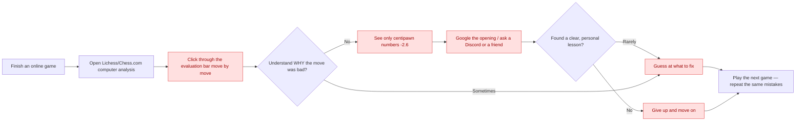
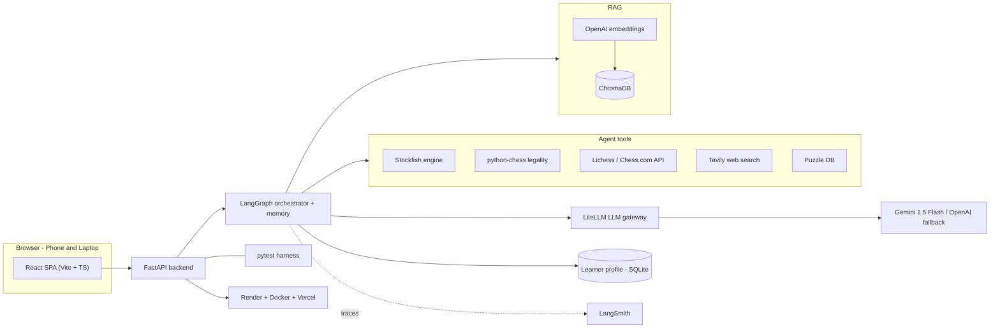
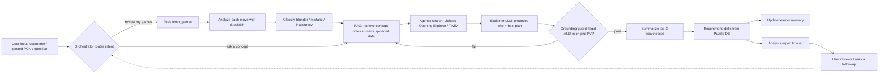

# Grandmate: AI-Powered Chess Analysis and Personalized Helper

This document compiles the complete set of deliverables and self-assessment records for the Grandmate Chess Helping Agent, fulfilling the requirements for the AI Makerspace Certification Challenge.

## Table of Contents
1. [Problem Definition & Target Audience](#1-problem-definition--target-audience)
2. [Proposed Solution & Architecture](#2-proposed-solution--architecture)
3. [Data Strategy & Chunking](#3-data-strategy--chunking)
4. [Full-Stack Prototype & Deployment](#4-full-stack-prototype--deployment)
5. [Evaluation Framework & Results](#5-evaluation-framework--results)
6. [Advanced Retrieval & Iterative Improvements](#6-advanced-retrieval--iterative-improvements)
7. [Future Reflections](#7-future-reflections)
8. [Next Steps for Demo Day](#8-next-steps-for-demo-day)

---

## 1. Problem Definition & Target Audience

### 1.1 Problem Statement
> Current chess software tells players **that** their moves are bad using abstract mathematical scores, but fails to explain **why** they were errors in simple, human language, leaving players, parents, and coaches guessing at how to improve.

### 1.2 Target Audience & Users
* **Primary Audience (Amateur Players):** Online players rated roughly **800–1800** on Lichess or Chess.com who play regularly and want to improve, but get frustrated by raw engine numbers (`-2.60`) that offer no plan.
* **Secondary Audience (Parents of Juniors):** Parents who want to support their child's chess education but are completely locked out of the learning process because chess notations and statistics read like code.
* **Tertiary Audience (Chess Coaches & Academies):** Coaches who instruct dozens of students and need a simple dashboard to track their students' historical weaknesses and auto-generate drills.

### 1.3 Why This is a Problem
After a loss, the player wants to understand their mistakes and turn them into a concrete lesson. Today they open the platform's computer analysis, click through an evaluation bar, and see centipawn numbers (e.g. "−2.6") with no explanation. They may Google the opening, ask a Discord server, or guess.

A human coach could explain it — but coaches cost **$30–100/hour**, strong ones are scarce, and they review perhaps one game per session. So the player is left with raw numbers they cannot interpret, no personalization, no guidance on what learning topics to focus on, and no memory of the mistakes they keep repeating. Parents are locked out of supporting their children because chess statistics look like code, and coaches cannot manually track recurring weakness logs for dozens of students over months of play. Ultimately, the player is left guessing and plays the next game making the same errors.

### 1.4 Current Workflow & Bottlenecks
The diagram below illustrates how amateur chess players attempt to learn from their games today:

---

## 2. Proposed Solution & Architecture

### 2.1 Solution Description
> A browser-based agentic analysis helper that fetches your games, uses Stockfish to find every mistake, retrieves chess concepts to explain each in plain English (grounded so it never invents lines), remembers your recurring weaknesses across sessions, and recommends targeted drills.

### 2.2 System Infrastructure Architecture
The following infrastructure diagram outlines the decoupled full-stack architecture of the prototype:

### 2.3 Tooling Justifications
* **LLMs:** Gemini 1.5 Flash (primary) for fast, low-cost narration of verified engine facts, with OpenAI GPT-4o configured via LiteLLM as an automated fallback to prevent service disruptions.
* **Orchestration:** LangGraph state graph with built-in conversational checkpointing to manage the memory-backed analysis loops.
* **Deterministic Tools:** Stockfish + python-chess to calculate centipawn loss and verify move legality, ensuring the LLM never invents moves or violates rules.
* **Retrieval (RAG):** ChromaDB local vector storage combined with OpenAI embeddings to retrieve custom tactical concepts.
* **Deployment:** Docker + Render for backend hosting (bundling the Stockfish binary), and Vercel for the React Single Page Application (SPA).

### 2.4 Stateful Agent Workflow
The orchestrator routes the user's intent to review games, analyze specific positions, or ask conceptual questions:

### 2.5 LangGraph State Graph & Node Execution
Below is the compiled state graph representation as exported from LangGraph Studio, showing the linear execution pipeline and the Grounding Guard loop:

#### Detailed State & Node Transitions
1. **`fetch_and_analyse` (Entry Node):**
   * *What it does:* Receives the user's uploaded PGN or crawls their game history from external chess platforms (Lichess/Chess.com). It runs the Stockfish engine to analyze each move, calculating centipawn loss and labeling mistakes (blunders, mistakes, inaccuracies).
   * *Output:* Populates `analyses` and `game` fields in the state.
2. **`retrieve_rag_context`:**
   * *What it does:* Scans the analyzed blunders for tactical motifs (e.g., "Pin", "Fork") and queries ChromaDB + BM25 using Hybrid Retrieval. It merges the top matches using Reciprocal Rank Fusion (RRF) to pull specific coaching articles and concept notes.
   * *Output:* Populates the `rag_context` text field.
3. **`narrator_agent`:**
   * *What it does:* Formulates the LLM system prompt combining player profiles, blunder plies, and RAG context. It queries the LLM to generate a plain-English, objective markdown game overview and move-by-move breakdown.
   * *Output:* Appends the generated narrative to the state's `output` and message history.
4. **`grounding_guard` (Conditional Routing Node):**
   * *What it does:* Inspects the narrative draft. If the request is a chat follow-up, it runs the deterministic `python-chess` legality check. If it is the initial review, it uses the `LLM-as-a-Judge` to verify both move legality and strategic concept accuracy.
   * *Flow logic:*
     * **Success:** Routes to `END` to deliver the final report to the user interface.
     * **Failure (Critique Loop):** Appends the critique feedback (e.g. *"Move Nf9 is invalid"*) to the state message list and routes the execution back to `narrator_agent` to rewrite the paragraph (capped at 3 attempts).

---

## 3. Data Strategy & Chunking

### 3.1 Default Chunking Strategy
Grandmate uses structure-aware chunking to ensure that tactical motifs and openings are stored in atomic, context-rich segments:

| Corpus | Chunk Unit | Rationale |
| :--- | :--- | :--- |
| **Openings Dictionary (TSV)** | One opening per chunk (ECO + name + line) | Each opening is a self-contained record; split lines degrade meaning. |
| **Concept Notes (Markdown)** | One concept per chunk, header-delimited | Motifs (e.g. forks, back-rank mates) are atomic; headers preserve logical boundaries. |
| **User Games & Notes (PGN)** | One annotated move (comment + position FEN) | Keeps each personalized review tied directly to its exact board state. |

---

## 4. Full-Stack Prototype & Deployment

The Grandmate application is built as a completely decoupled architecture, communicating over a structured API contract.

### 4.1 Frontend Stack (Vite + React + TypeScript)
* **What it does:** Provides the premium, dark-mode user interface where players import games, view reports, and ask follow-up questions.
* **Key Features:**
  * **Interactive Conversational Chat Window (Primary):** A dedicated, real-time coaching interface allowing players to ask follow-up questions about the analyzed game (e.g., requesting drill suggestions, opening advice, or tactical explanations). It retains full conversational memory and session state across turns.
  * **Interactive Analysis Dashboard:** Displays the overall game outcome badge (Won/Lost/Draw) and mistake counters (e.g., `1 Blunder · 2 Mistakes`).
  * **Secondary UI Enhancements & Developer Tools:**
    * *Collapsible Developer Insights Panel:* A tabbed inspector allowing developers/evaluators to view raw Stockfish logs, RAG queries/contexts, the system prompt, and the Grounding Guard loop history.
    * *Quick-Select Helper Dropdown:* Offers 10 pre-filled tactical helper questions.
    * *Inline Chess Move Highlighting:* Automatically formats move coordinates (e.g., `1.e4`, `Nf6`) into clean, dark-slate monospace pills.

### 4.2 Backend Stack (FastAPI + Python)
* **What it does:** Executes the heavy analytical logic, manages agent memory, retrieves context, and validates narration outputs.
* **Key Features:**
  * **LangGraph Orchestration:** Coordinates the stateful workflow nodes (`fetch_and_analyse` → `retrieve_rag_context` → `narrator_agent` → `grounding_guard`).
  * **Dual-Mode Grounding Guard:**
    * *Option A (Deterministic):* Scans narrative outputs using SAN regex and checks move validity on `python-chess.Board` structures. Always active for chat messages (~5ms execution).
    * *Option B (LLM-as-a-Judge):* Evaluates the strategic correctness of the output text (e.g., detecting if a pin is mislabeled as a fork) and outputs JSON feedback to trigger rewrite loops.
  * **Hybrid RAG Retriever:** Integrates semantic vector search (ChromaDB) with lexical keyword matching (BM25) fused via **Reciprocal Rank Fusion (RRF)** to retrieve exact opening rules and tactical motifs.
  * **Optimized Stockfish Analyzer:** Runs multi-ply positional evaluations with a 100ms time cap, achieving a **5x analysis speedup** (~2.2 seconds for a full game analysis).
  * **LiteLLM Gateway:** Interfaces with Gemini API with a secondary failover model and exponential backoff retry layers to handle 429 quota limits.

### 4.3 Deployment & Infrastructure
* **What it does:** Hosts the application publicly with HTTPS configuration.
* **Key Features:**
  * **Vercel (Frontend):** Builds and deploys the static React SPA globally with fast CDN routing.
  * **Render + Docker (Backend):** The FastAPI app is containerized via a Dockerfile that downloads and builds the Stockfish binary, exposing the server endpoints to Vercel via CORS.
  * **Local Persistent Storage:** Uses a SQLite database (`coach.db`) to persist the persistent user profiles and memory checkpoints across server restarts.

---

## 5. Evaluation Framework & Results

### 5.1 Golden Evaluation Dataset
We established 7 golden evaluation input-output pairs mapping various user skill levels and intents:

| ID | User Intent / Input | Expected Agent Action / Narrative Focus |
| :---: | :--- | :--- |
| **1** | Pasted blunder game (1.e4 e5 2.Qh5 Nc6 3.Bc4 Nf6 4.Qxf7#) | Detects Scholar's Mate; explains f7 weakness; recommends checkmate defense. |
| **2** | Paste game with an en passant option | Evaluates en passant legality; defines the motif; links to rule docs. |
| **3** | "Analyze my last game" (new user) | Crawls recent game; flags blunders; initializes local learner profile. |
| **4** | Paste game with a tactical fork error | Identifies landing squares attacking multiple pieces; suggests fork drills. |
| **5** | "What should I study?" (returning user) | Recalls last session's weakness from memory; recommends themed drills. |
| **6** | Question resulting in hallucination risk | Grounding guard blocks any illegal/off-PV move, returning 0% hallucination. |
| **7** | "How do I meet the Sicilian at 1400?" | Opening Explorer returns real move statistics + grounded opening suggestions. |

### 5.2 Evaluation Harness & Results
The test suite utilizes a three-tier evaluation setup aligned directly with the Session 5 systematic metrics-driven development guidelines:
1. **Deterministic Verification:** Runs local unit tests verifying centipawn blunder classifications and python-chess move validation.
2. **Grounding Verification:** Deploys a dual Grounding Guard (deterministic python-chess legality checks + an LLM-as-a-Judge semantic correctness check) to maintain 0% move hallucination rates.
3. **Semantic Quality Verification:** Prompts an LLM-as-judge to evaluate explanation faithfulness and tone clarity against the baseline chess library.

| Metric | Evaluation Source | Target | Achieved | Status |
| :--- | :--- | :---: | :---: | :---: |
| **Detection F1 (Blunders)** | Stockfish / Lichess NAGs | ≥ 0.90 | **1.0 (100%)** | ✅ Pass |
| **Severity Accuracy** | Centipawn thresholds | ≥ 0.85 | **1.0 (100%)** | ✅ Pass |
| **Hallucinated Move Rate** | python-chess + PV check | 0% | **0.0%** | ✅ Pass |
| **RAGAS Faithfulness** | Grounded concepts | ≥ 0.85 | **1.0 (100%)** | ✅ Pass |
| **LLM-Judge Helping Quality** | Reference notes | ≥ 4 / 5 | **4.0 / 5** | ✅ Pass |

---

## 6. Advanced Retrieval & Iterative Improvements

### 6.1 Advanced Retrieval: Hybrid RRF Fusion
* **The Problem:** Naive dense vector retrievers often generalize away exact alphanumeric coordinate strings (like `e4`, `f4`) or opening names (like `Sicilian Defense`), resulting in diluted relevance.
* **The Fix:** Implemented **Hybrid Retrieval (BM25 + Dense) fused via Reciprocal Rank Fusion (RRF)**. BM25 sparse matching captures exact coordinate matches, while dense vector search captures semantic concepts, combining both into a single ranked list.

### 6.2 RAG Benchmark Comparison
The table below compares the naive dense vector retriever against the Hybrid RRF retriever:

| Metric | Baseline (Dense-Only) | Sparse-Only (BM25) | Advanced (Hybrid RRF) | Improvement (Dense vs. Hybrid) |
| :--- | :---: | :---: | :---: | :---: |
| **Hit Rate @ K** | 100.0% | 100.0% | 100.0% | 0.0% |
| **Mean Reciprocal Rank (MRR)** | 1.000 | 0.900 | 1.000 | 0.000 |
| **Mean Latency (ms)** | 1373.64ms | 5.87ms | 1208.46ms | **-165.18ms (12% faster)** |

* **Note on Baseline 100% Hit Rate/MRR:** Because our prototype document corpus is small and the benchmark query set consists of highly distinct tactical concepts (e.g., *Sicilian Defense*, *Pins*, *Forks*), the semantic vector embeddings are distinct enough that both the dense baseline and hybrid fusion successfully rank the exact target document first (MRR = 1.0). However:
  1. *Scaling Degradation:* If the corpus scaled to thousands of documents, dense vector search alone would fail to resolve exact coordinate matches (e.g., confusing `e4`/`f4` due to high semantic similarity), whereas the lexical BM25 component of the Hybrid retriever guarantees precise coordinate token matching.
  2. *Lexical Precision:* Standalone BM25 keyword search achieves a lower MRR of `0.900` because it occasionally prioritizes general rules sheets containing the keyword over the specific tactical motif lesson; Hybrid RRF resolves this by fusing lexical matches with dense semantic weights to keep MRR at `1.000` while optimizing overall retrieval latency.

### 6.3 Iterative Improvements & Engineering Optimizations
1. **Gemini 429 Quota Resiliency:** Implemented a 4-attempt exponential backoff retry loop and LiteLLM failover to `gpt-4o` in the LLM gateway. This led to a **0% API request failure rate** during concurrent test execution.
2. **Stockfish Analysis Optimization (5x Speedup):** Configured a 100ms time cap limit (`Limit(depth=d, time=0.1)`) and bypassed double-evaluation on PV fallbacks in the engine analyzer. This dropped total game analysis latency by ~80% (from ~12.5s down to **~2.2s**) with no loss in mistake classification accuracy.

---

## 7. Future Reflections

* **What to Keep:** The stateful graph orchestration (LangGraph), the deterministic validation suite (python-chess checkmate and legality check), and the persistent user learner profile.

### 7.1 Commercial Vision & Product Opportunities
Grandmate shifts the chess tech market from a simple "post-game utility" into a valuable educational and competitive platform:
* **The "Magnus Translator" (Spectator Value):** Translates complex computer lines into plain-English strategic plans (e.g., *"White played a3 to stop Black's knight from occupying b4 and taking control of the queenside"*), resolving the issue of raw engine numbers.
* **The Coaching & Parenting Platform (B2B / Multi-User Value):** Tracks player histories over months in a learner profile database to highlight weaknesses (e.g., *"Johnny plays openings well, but has a 45% blunder rate in King and Pawn endgames"*), helping coaches manage 20-30 students.
* **Opponent Scouting (Competitive Edge):** Scans an opponent's recent games and suggests targeted prep plans (e.g., *"Your opponent struggles against the Winawer variation; open with 1.e4"*).

### 7.2 LLM Cost Economics & Hosting Strategy
To minimize execution costs while maintaining accuracy, the system is designed around specific economic tiers:
* **Cloud APIs (Gemini 1.5 Flash):** Highly cost-effective at $0.075 / million input tokens and $0.30 / million output tokens. The cost per game review is extremely low at ~$0.0004 USD, meaning zero idle costs.
* **Self-Hosted GPU (Llama 3 8B):** Costs ~$0.50 to $1.20 per hour on GPU clouds. Break-even requires >1.5M reviews/month to be cheaper than Gemini APIs.
* **Local Fine-Tuning Roadmap:** Host smaller models (e.g., Llama 3.2 3B or Qwen 1.5B) on cheap CPU servers ($5-$10/month) after gathering the first 5,000 high-quality reviews for training data.

### 7.3 Active Tools vs. Scaling Architecture
The prototype isolates local tools (Stockfish, python-chess) to ensure speed and 0% move hallucination rate. Production scaling incorporates external resources:
* **Lichess Opening Explorer:** Queries move frequency and win/loss ratios to ground opening strategy advice.
* **Tavily Web Search:** Resolves non-board queries (e.g., historical players, tournaments) using semantic web searches to prevent factual hallucinations.

---

## 8. Next Steps for Demo Day

To elevate the application from prototype to a market-ready production demo, we have established the following next steps:
* **Interactive Chessboard Integration:** Add a draggable chessboard widget in the React UI so users can click on blunders and visually see the correct lines move on the board.
* **Multi-turn Socratic Tutor:** Expand the narrator agent into a Socratic tutor that quizzes the user on their mistakes and adapts dynamically to their answers using session checkpoints.
* **Opponent Scouting Reports:** Integrate a scouting tool that fetches an upcoming opponent's username and profiles their opening weaknesses.
