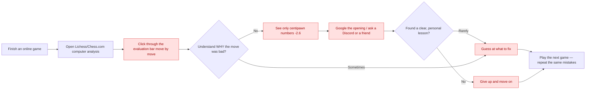
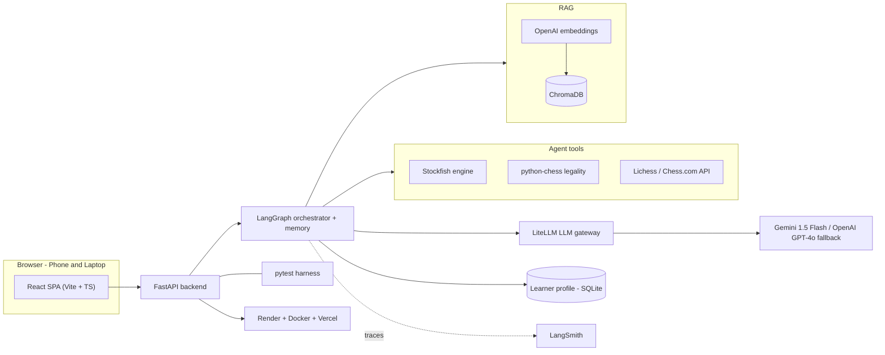
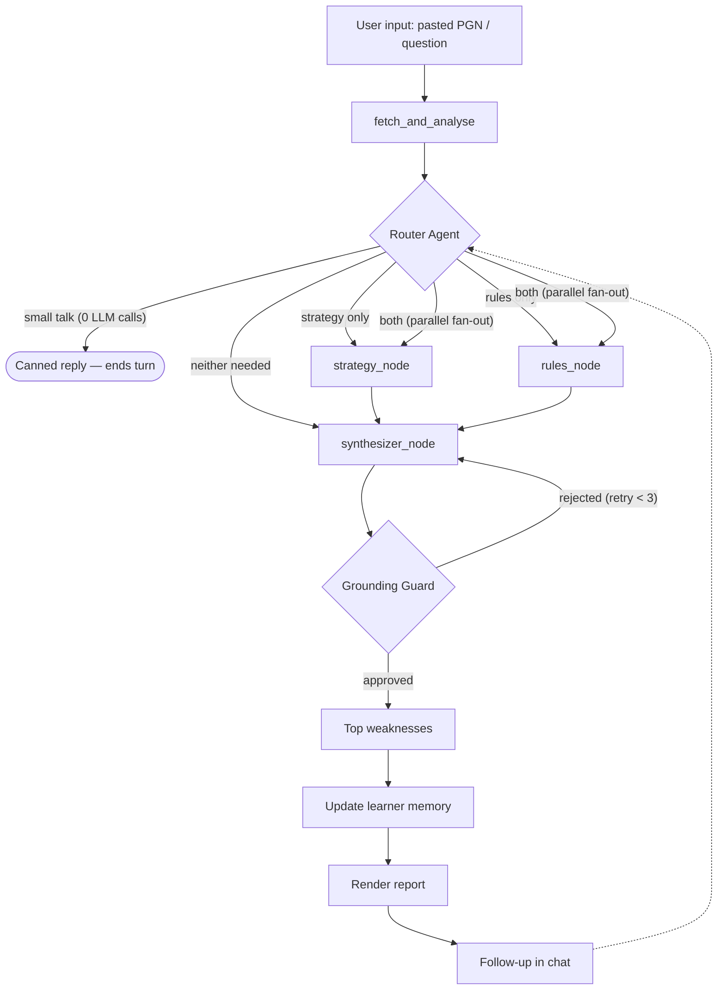
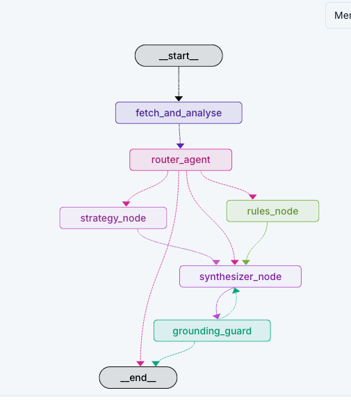

# Grandmate: AI-Powered Chess Analysis and Personalized Helper

This document compiles the complete set of deliverables and self-assessment records for the Grandmate Chess Helping Agent, fulfilling the requirements for the AI Makerspace Certification Challenge.

## Table of Contents
1. [Problem Definition & Target Audience](#1-problem-definition--target-audience)
2. [Proposed Solution & Architecture](#2-proposed-solution--architecture)
3. [Data Strategy & Chunking](#3-data-strategy--chunking)
4. [Full-Stack Prototype & Deployment](#4-full-stack-prototype--deployment)
5. [Evaluation Framework & Results](#5-evaluation-framework--results)
6. [Advanced Retrieval & Iterative Improvements](#6-advanced-retrieval--iterative-improvements)
7. [Future Reflections](#7-future-reflections)
8. [Next Steps for Demo Day](#8-next-steps-for-demo-day)

---

## 1. Problem Definition & Target Audience

### 1.1 Problem Statement
> Current chess software tells players **that** their moves are bad using abstract mathematical scores, but fails to explain **why** they were errors in simple, human language, leaving players, parents, and coaches guessing at how to improve.

### 1.2 Target Audience & Users
* **Primary Audience (Amateur Players):** Online players rated roughly **800–1800** on Lichess or Chess.com who play regularly and want to improve, but get frustrated by raw engine numbers (`-2.60`) that offer no plan.
* **Secondary Audience (Parents of Juniors):** Parents who want to support their child's chess education but are completely locked out of the learning process because chess notations and statistics read like code.
* **Tertiary Audience (Chess Coaches & Academies):** Coaches who instruct dozens of students and need a simple dashboard to track their students' historical weaknesses and auto-generate drills.

### 1.3 Why This is a Problem
After a loss, the player wants to understand their mistakes and turn them into a concrete lesson. Today they open the platform's computer analysis, click through an evaluation bar, and see centipawn numbers (e.g. "−2.6") with no explanation. They may Google the opening, ask a Discord server, or guess.

A human coach could explain it — but coaches cost **$30–100/hour**, strong ones are scarce, and they review perhaps one game per session. So the player is left with raw numbers they cannot interpret, no personalization, no guidance on what learning topics to focus on, and no memory of the mistakes they keep repeating. Parents are locked out of supporting their children because chess statistics look like code, and coaches cannot manually track recurring weakness logs for dozens of students over months of play. Ultimately, the player is left guessing and plays the next game making the same errors.

### 1.4 Current Workflow & Bottlenecks
The diagram below illustrates how amateur chess players attempt to learn from their games today:

*(Copy in [`diagrams/user-workflow-pain-points.md`](diagrams/user-workflow-pain-points.md).)*

---

## 2. Proposed Solution & Architecture

### 2.1 Solution Description & Naming Rationale
* **Proposed Solution:**
  > A browser-based agentic analysis helper that fetches your games, uses Stockfish to find every mistake, retrieves chess concepts to explain each in plain English (grounded so it never invents lines), remembers your recurring weaknesses across sessions, and recommends targeted drills.
* **Naming Choice (Grandmate / GameMate):**
  The project name **Grandmate** (originally conceived as **GameMate**) is a play on two central chess concepts: **Grandmaster** (the ultimate title of chess expertise) and **Checkmate** (the defining goal of the game). The suffix **"-mate"** also functions in its colloquial sense as a friendly companion or partner. Grandmate thus positions itself not merely as a cold, analytical software tool, but as an interactive, conversational companion helping amateur players learn to analyze their games with Grandmaster-level clarity.

### 2.2 System Infrastructure Architecture
The following infrastructure diagram outlines the decoupled full-stack architecture of the prototype:

*(Copy in [`diagrams/system-infrastructure.md`](diagrams/system-infrastructure.md).)*

### 2.3 Tooling Justifications
* **LLMs:** Gemini 1.5 Flash (primary, `LLM_MODEL=gemini/gemini-1.5-flash`) for reasoning over and narrating verified engine facts, with OpenAI GPT-4o configured via LiteLLM as an automated fallback to prevent service disruptions.
* **Orchestration:** LangGraph state graph with built-in conversational checkpointing to manage the memory-backed analysis loops, wired as a multi-agent router → specialist → synthesizer team.
* **Deterministic Tools:** Stockfish + python-chess to calculate centipawn loss and verify move legality, ensuring the LLM never invents moves or violates rules.
* **Retrieval (RAG):** ChromaDB local vector storage combined with OpenAI embeddings, over a dual-corpus bucketed index (`rules/` vs. `strategies/`) so each specialist agent retrieves only from its own library.
* **Deployment:** Docker + Render for backend hosting (bundling the Stockfish binary), and Vercel for the React Single Page Application (SPA).

### 2.4 Stateful Agent Workflow
The orchestrator routes the user's intent to review games, analyze specific positions, or ask rules/strategy questions:

*(Copy in [`diagrams/agent-workflow.md`](diagrams/agent-workflow.md).)*

### 2.5 LangGraph State Graph & Node Execution
The multi-agent StateGraph coordinates sequential worker node execution and grounding:

#### 2.5.1 Detailed State & Node Transitions
1. **`fetch_and_analyse` (Entry Node):**
   * *What it does:* Receives the user's uploaded PGN and runs the Stockfish engine to analyze each move, calculating centipawn loss and labeling mistakes (blunders, mistakes, inaccuracies).
   * *Output:* Populates `analyses` and `game` fields in the state.
2. **`router_agent`:**
   * *What it does:* Inspects conversation history and game state to determine whether rules questions or strategy questions need specialist delegation. Bypasses LLM routing deterministically if findings are already present.
   * *Small-talk short-circuit:* A message that is *purely* a greeting, thanks, or farewell ("hi", "thanks", "bye") is matched against a deterministic allowlist and answered from a template — 0 LLM calls, no specialist, and no grounding guard, since a canned reply names no moves. Matching is whole-message, so a real question that merely opens politely ("Hi, why was my move a blunder?") still reaches normal classification.
3. **`strategy_node`:**
   * *What it does:* Queries the `strategies` RAG database for tactical concepts and positional motifs, executing a specialized strategy coaching prompt.
4. **`rules_node`:**
   * *What it does:* Queries the `rules` RAG database for official rules, stalemate, and legality validations, including the FIDE Laws of Chess PDF ingested page-by-page.
5. **`synthesizer_node`:**
   * *What it does:* Consolidated responder that combines strategy and rules findings into a unified, user-friendly markdown narrative.
6. **`grounding_guard`:**
   * *What it does:* Inspects the narrative draft. The initial `/review` uses the LLM-as-a-Judge check; a chat follow-up (a prior AI turn already exists in state) always forces the fast deterministic python-chess legality check instead, regardless of whether the question was about rules or strategy.
   * *Flow logic:*
     * **Success:** Routes to `END` to deliver the final report to the user interface.
     * **Failure (Critique Loop):** Appends the critique feedback (e.g. *"Move Nf9 is invalid"*) to the state message list and routes the execution back to `synthesizer_node` to rewrite the paragraph (capped at 3 attempts).

---

## 3. Data Strategy & Chunking

### 3.1 Default Chunking Strategy
Grandmate uses structure-aware chunking to ensure that tactical motifs and openings are stored in atomic, context-rich segments:

| Corpus | Bucket | Chunk Unit | Rationale |
| :--- | :--- | :--- | :--- |
| **Openings Dictionary (TSV)** | `strategies` | One opening per chunk (ECO + name + line) | Each opening is a self-contained record; split lines degrade meaning. |
| **Concept Notes (Markdown)** | `strategies` / `rules` | One concept per chunk, header-delimited | Motifs (e.g. forks, back-rank mates) are atomic; headers preserve logical boundaries. |
| **FIDE Laws of Chess (PDF)** | `rules` | Page-by-page, then recursively split (1000 chars, 200 overlap) | Articles run across pages; recursive splitting with overlap keeps a law and its clauses in one chunk. |
| **User Games & Notes (PGN)** | — | One annotated move (comment + position FEN) | Keeps each personalized review tied directly to its exact board state. |

Every chunk is tagged at ingestion with a `bucket` metadata field (`rules` or `strategies`) matching
its parent directory under `backend/data/corpus/`. This is what lets each specialist agent retrieve
strictly from its own library, so rulebook language never bleeds into strategy advice and vice versa.

> **The FIDE Laws of Chess PDF is now ingested.** `pypdf` is declared in `backend/pyproject.toml`, so
> `load_pdf` parses the rulebook page-by-page into the `rules` bucket. The current index holds **339 chunks**
> (`rules`=175, `strategies`=164); rulebook-only queries such as "fifty move rule draw claim" now retrieve
> actual FIDE article text.

---

## 4. Full-Stack Prototype & Deployment

The Grandmate application is built as a completely decoupled architecture, communicating over a structured API contract.

### 4.1 Frontend Stack (Vite + React + TypeScript)
* **What it does:** Provides the premium, dark-mode user interface where players import games, view reports, and ask follow-up questions.
* **Key Features:**
  * **Interactive Conversational Chat Window (Primary):** A dedicated, real-time coaching interface allowing players to ask follow-up questions about the analyzed game (e.g., requesting drill suggestions, opening advice, or tactical explanations). It retains full conversational memory and session state across turns.
  * **Interactive Analysis Dashboard:** Displays the overall game outcome badge (Won/Lost/Draw) and mistake counters (e.g., `1 Blunder · 2 Mistakes`).
  * **Secondary UI Enhancements & Developer Tools:**
    * *Collapsible Developer Insights Panel (Graph Execution Inspector):* A six-tab inspector — **engine · rag · prompt · grounding · agents · logs** — allowing developers/evaluators to view raw Stockfish logs, RAG queries/contexts, the system prompt, the Grounding Guard loop history, the per-agent prompt/response trace (`agent_steps`, each rendered as flattened `[ROLE]: content` lines), and the plain-text `execution_log` trail of every node in execution order.
    * *Quick-Select Helper Dropdown:* Offers 10 pre-filled tactical helper questions. The sample-game (PGN) dropdown always renders — if no games load it appears disabled with a message distinguishing an unreachable backend from a backend that returned zero games.
    * *Inline Chess Move Highlighting:* Automatically formats move coordinates (e.g., `1.e4`, `Nf6`) into clean, dark-slate monospace pills.

### 4.2 Backend Stack (FastAPI + Python)
* **What it does:** Executes the heavy analytical logic, manages agent memory, retrieves context, and validates narration outputs.
* **Key Features:**
  * **LangGraph Multi-Agent Orchestration:** Coordinates the stateful workflow nodes (`fetch_and_analyse` → `router_agent` → `strategy_node` / `rules_node` → `synthesizer_node` → `grounding_guard`), with the router deciding dispatch in a single visit per turn — one specialist, both in parallel (fan-out/fan-in on `synthesizer_node`), or neither — and deciding without an LLM call wherever state already implies the answer. Specialist findings persist across turns as background context.
  * **Dual-Mode Grounding Guard:**
    * *Option A (Deterministic):* Scans narrative outputs using SAN regex and checks move validity on `python-chess.Board` structures. Always active for chat messages (~5ms execution).
    * *Option B (LLM-as-a-Judge):* Evaluates the strategic correctness of the output text (e.g., detecting if a pin is mislabeled as a fork) and outputs JSON feedback to trigger rewrite loops.
  * **Dual-Corpus Hybrid RAG Retriever:** Integrates semantic vector search (ChromaDB) with lexical keyword matching (BM25) fused via **Reciprocal Rank Fusion (RRF)** to retrieve exact opening lines and tactical motifs. The corpus is partitioned into `rules/` and `strategies/` (openings TSV + tactics notes); every chunk carries a `bucket` metadata tag, and the bucket filter is applied to *both* the dense query and the BM25 candidate set before fusion, so a specialist can only retrieve from its own library. (The `rules/` bucket carries the FIDE Laws of Chess PDF parsed page-by-page — see §3.1.)
  * **Optimized Stockfish Analyzer:** Runs multi-ply positional evaluations with a 100ms time cap, achieving a **5x analysis speedup** (~2.2 seconds for a full game analysis).
  * **LiteLLM Gateway:** Interfaces with the Gemini API (Gemini 1.5 Flash) with OpenAI GPT-4o as the secondary failover model, plus exponential backoff retry layers to handle 429 quota limits.

### 4.3 Deployment & Infrastructure
* **What it does:** Hosts the application publicly with HTTPS configuration.
* **Key Features:**
  * **Vercel (Frontend):** Builds and deploys the static React SPA globally with fast CDN routing.
  * **Render + Docker (Backend):** The FastAPI app is containerized via a Dockerfile that downloads and builds the Stockfish binary, exposing the server endpoints to Vercel via CORS.
  * **Local Persistent Storage:** Uses a SQLite database (`coach.db`) to persist the persistent user profiles and memory checkpoints across server restarts.
  * **Corpus Ships With the Image:** `backend/data/corpus/` (both buckets) and `backend/data/pgn/Carlsen.pgn` are tracked in git so the Render build contains them; only the generated vector store (`/data/chroma/`) is ignored. A bare `data/` ignore pattern matches at every directory level and had silently stripped the RAG corpus and sample games from the deploy while everything still worked locally — `git ls-files backend/data` is the guard against that regression.

---

## 5. Evaluation Framework & Results

### 5.1 Golden Evaluation Dataset
Seven scenarios spanning detection, theming, routing, and grounding — each traceable to a concrete
seed position, test, or report field rather than asserted narrative. (An earlier version of this
table included a returning-user memory-recall scenario and an Opening Explorer lookup. The Opening
Explorer row was removed because that tool isn't implemented — that tool is not built.
The memory-recall row was removed because there is no durable, cross-session learner profile in the
code today — only an in-process LangGraph checkpointer that doesn't survive a restart. The durable
profile is intended design, not current state; it is listed as the first item in §7.2.)

| ID | User Intent / Input | Expected Agent Action / Narrative Focus | Grounded in |
| :---: | :--- | :--- | :--- |
| **1** | Pasted blunder game (1.e4 e5 2.Qh5 Nc6 3.Bc4 Nf6 4.Qxf7#) | Detects Scholar's Mate; explains f7 weakness; recommends checkmate defense. | Seed position in `evals/generate_synthetic.py` ("Scholar's mate threat on f7"); scored by the detection harness. |
| **2** | Paste game with an en passant option | Evaluates en passant legality; defines the motif; links to rule docs. | Seed position in `evals/generate_synthetic.py`; the `en_passant` slice reaches 100% agreement in the latest run. |
| **3** | Paste game with a pawn promoting on the 7th/8th rank | Detects promotion vs. underpromotion; explains why a queen (or an underpromotion) was correct. | Seed position in `evals/generate_synthetic.py`; promotions are among the harness's weakest slices at 71% agreement (see §5.2). |
| **4** | Paste game with a tactical fork error | Flags the move attacking 2+ pieces via the deterministic `classify_theme` heuristic; retrieves fork-themed RAG content. | `backend/src/coach/analysis/themes.py::classify_theme` "Fork" branch — a rule, not an LLM guess. |
| **5** | "What is stalemate?" as a chat follow-up after an initial review | Router fast-paths (no reclassification LLM call once findings exist); `rules_node` retrieves from the FIDE PDF bucket; grounding guard is forced to deterministic mode for the chat turn. | `backend/tests/test_phase9.py::test_router_delegates_to_rules`. |
| **6** | Question resulting in hallucination risk | Grounding guard blocks any illegal/off-PV move before it reaches the user. | `evals/test_grounding.py`; `illegal_move_rate` in `evals/report.json`. |
| **7** | "How do I meet the Sicilian?" (strategy question) | `strategy_node` retrieves only from the `strategies` corpus bucket (openings + tactics), never `rules` — the bucket filter is applied before RRF fusion. | `backend/tests/test_phase9.py::test_router_delegates_to_strategy`. |

### 5.2 Evaluation Harness & Results

Three layers of checks:

1. **Correctness** — unit tests over move classification and legality.
2. **Grounding** — every move named in an answer is checked against the engine, by rule first and
   then by an LLM reviewer.
3. **Quality** — an LLM reviewer scores how faithful and how helpful each explanation is.

| Metric | Measured against | Target | Result | |
| :--- | :--- | :---: | :---: | :---: |
| Detection F1 (blunders) | Independent Stockfish depth-24 analysis | ≥ 0.90 | **0.9294** | ✅ |
| Severity accuracy | Independent depth-24 analysis | ≥ 0.85 | **0.9073** | ✅ |
| Hallucinated move rate | python-chess legality + engine lines | 0% | **0.0000%** | ✅ |
| Faithfulness | Retrieved sources + engine facts | ≥ 0.85 | **0.8667** | ✅ |
| Coaching quality | Reference notes | ≥ 4 / 5 | **3.17 / 5** | ⚠️ measured on single-move test games, not full games |

Detection is measured over all 151 positions. The judged metrics use 12 samples.

Produced by `evals/report.py`; raw output in `evals/report.json`. Dataset design is described in
[synthetic_data_and_eval_design.md](./synthetic_data_and_eval_design.md).

**The detection score is genuinely earned.** Ground truth comes from Stockfish at depth 24, which is
independent of the classifier being graded — the production system runs at depth 16 with its own
thresholds. To prove the test can fail, we deliberately broke those thresholds so that no move could
be classified as a mistake: F1 fell from 0.95 to **0.19**. A test that cannot fail proves nothing,
so this matters more than the passing score itself.

Accuracy is not uniform. Near-miss inaccuracies are hardest to agree on (70%), followed by
promotions (71%), while en passant, forced mate, and move disambiguation reach 100%.

**Two limitations apply.** These figures measure the fallback model rather than the configured
primary, which is currently unavailable; and the engine does not repeat exactly, so detection
figures carry a tolerance of about ±0.02.

---

## 6. Advanced Retrieval & Iterative Improvements

### 6.1 Advanced Retrieval: Hybrid RRF Fusion
* **The Problem:** Plain dense vector search often generalizes away exact terms — coordinates like
  `e4`/`f4`, or opening names like "Sicilian Defense" — and returns diluted results.
* **The Fix:** Hybrid Retrieval (BM25 + Dense), fused with Reciprocal Rank Fusion (RRF). BM25
  catches exact matches; dense search catches the meaning; RRF combines both into one ranked list.

### 6.2 RAG Benchmark Comparison
The table below compares the naive dense vector retriever against the Hybrid RRF retriever.

Measured by `evals/compare_retrievers.py` at K=3 over **135 queries derived from the corpus** (40 lexical + 46 extractive + 46 LLM-paraphrase + 3 negative), scored by chunk id, against the 339-chunk dual-corpus index (`rules`=175, `strategies`=164). All three strategies are exercised through the production `retrieve_context(..., retriever_type=, bucket=)`. Full report: [retriever_evaluation_report.md](./retriever_evaluation_report.md); design and outcome in [synthetic_data_and_eval_design.md](./synthetic_data_and_eval_design.md).

Bucketed (production path) — this is how the application actually retrieves, with a `bucket` filter applied to both retrieval halves before fusion:

| Metric | Baseline (Dense-Only) | Sparse-Only (BM25) | Advanced (Hybrid RRF) |
| :--- | :---: | :---: | :---: |
| **Hit Rate @ 3** | 87.1% | 80.3% | 85.6% |
| **Mean Reciprocal Rank (MRR)** | 0.795 | 0.755 | **0.817** |
| **Avg Latency (ms)** | 527ms | 178ms | 344ms |

* **Hybrid RRF wins.** It has the best ranking quality of the three (MRR **0.817**), ahead of dense-only (0.795) and BM25 (0.755). This is the retriever we ship.
* **An earlier "BM25 beats Hybrid" result was a flawed test, now fixed.** The old benchmark used literal lexical terms and verbatim corpus extracts — both easy wins for BM25's word-overlap matching. Once the query set includes genuinely **reworded** LLM paraphrases (closer to what a real user types), Hybrid RRF wins instead. Paraphrases are generated once and cached (`evals/paraphrase_cache.json`) so the test stays repeatable.
* **Bucket filtering helps every retriever.** Splitting the corpus into `rules` and `strategies` buckets, and filtering to the right one, raises Hybrid MRR from **0.710** (unbucketed) to **0.817** (bucketed) — the two corpora no longer bleed into each other. Unbucketed diagnostics: Dense 83.3%/0.684, BM25 78.8%/0.655, Hybrid 84.8%/0.710.
* **Known gap — no relevance floor.** On out-of-corpus questions (Go, football, backgammon), all three retrievers still return **3/3 false positives**. There's no score threshold yet, so RAG always hands back `k` chunks even when none of them are relevant. Not yet fixed.
* *Latency caveat:* Hit Rate and MRR are deterministic and reproduce exactly across runs. Latency is not — it's dominated by the remote embedding call and varies run to run, so read it as an order of magnitude, not a precise number.

---

## 7. Future Reflections

### 7.1 What worked, and should stay
* **Graph-based orchestration.** Routing and state are explicit and inspectable, which made both
  debugging and later redesign straightforward.
* **Rule-based move checking.** Using a chess engine rather than the language model to verify
  legality is the single most valuable safeguard, and is why the hallucinated-move rate is zero.
* **Grounding the narrative in engine facts.** Every claim traces back to something computed, not
  something the model recalled.

### 7.2 What to change
* **Build the durable learner profile.** Personalisation currently lasts one session. A returning
  player starts over. This is the product's central promise and the most important thing still
  missing.
* **Move to a managed vector database** for persistence and concurrency in production.
* **Chunk the reference material more finely,** so retrieval returns a specific idea rather than a
  broad section.
* **Route model choice through configuration,** so replacing a retired model is a settings change
  rather than a code change.

### 7.3 Where the product could go
* **Plain-English engine lines.** Translate computer analysis into the plan behind it — *"a3 stops
  the knight coming to b4"* — which is the part most players cannot read for themselves.
* **Coach and academy dashboards.** Track a student's weaknesses across months rather than one
  game. Depends on the learner profile above.
* **Opponent preparation.** Summarise an opponent's recent games into a short, targeted plan.

---

## 8. Next Steps for Demo Day

To elevate the application from prototype to a market-ready production demo, the following next
steps are planned.

**Suggested build order, and why:**

| Order | Item | Scope | Rationale |
| --- | --- | --- | --- |
| 1 | Durable learner profile | Backend-only; ~half a day | The one piece the product's whole personalization pitch (§7.3) depends on. Smallest, most self-contained change of the five — a new SQLite table plus two integration points, no new UI. |
| 2 | Interactive chessboard | Frontend-only, no backend changes | Highest visible payoff per unit of effort for a demo; doesn't touch the graph or any of the systems this review just fact-checked. |
| 3 | Socratic tutor flow | New stateful LangGraph node + new specialist-style prompt | Meaningfully larger — needs its own place in the router-specialist-synthesizer topology (§4 of `ARCHITECTURE.md`), not just a UI addition. |
| 4 | Opponent scouting | New ingestion path (bulk game history) + new aggregation logic | Similar size to the Socratic tutor flow, plus a new external-data dependency (crawling a user's full game history, not just one game). |
| 5 | External search + cloud storage | Infrastructure migration (Qdrant) + two new external tool integrations (Tavily, Opening Explorer) | Broadens *breadth* of knowledge rather than deepening the core loop — lowest urgency for a demo, and the largest infrastructure lift of the five. |

