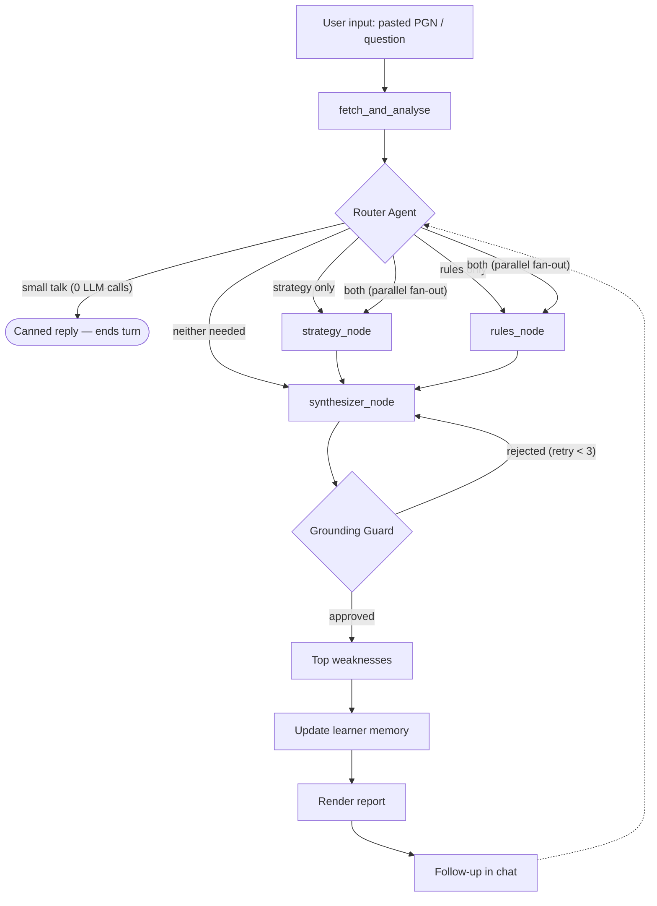

# Agent workflow (control flow)

Referenced from [`ARCHITECTURE.md` §4](../ARCHITECTURE.md#4-agent-workflow-control-flow) and
[`Deliverables.md` §2.4](../Deliverables.md#24-stateful-agent-workflow).

