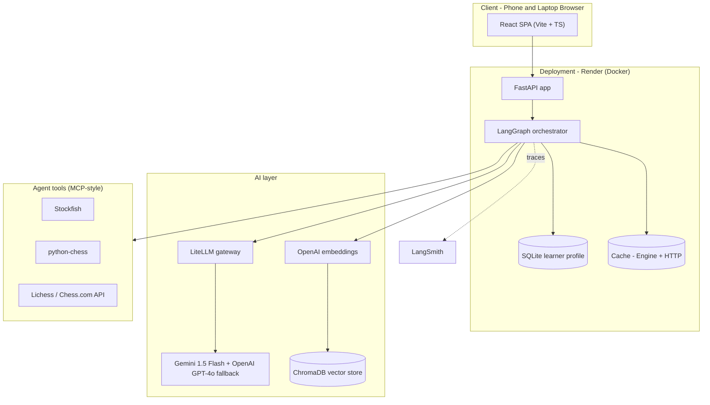

# Component architecture

Referenced from [`ARCHITECTURE.md` §2](../ARCHITECTURE.md#2-component-architecture).

```mermaid
flowchart TB
    subgraph Client["Client - Phone and Laptop Browser"]
      UI["React SPA (Vite + TS)"]
    end

    subgraph Edge["Deployment - Render (Docker)"]
      API["FastAPI app"]
      ORCH["LangGraph orchestrator"]
      MEM[("SQLite learner profile")]
      CACHE[("Cache - Engine + HTTP")]
    end

    subgraph AI["AI layer"]
      GW["LiteLLM gateway"]
      LLM["Gemini 1.5 Flash + OpenAI GPT-4o fallback"]
      EMB["OpenAI embeddings"]
      VDB[("ChromaDB vector store")]
    end

    subgraph Tools["Agent tools (MCP-style)"]
      SF["Stockfish"]
      PC["python-chess"]
      LI["Lichess / Chess.com API"]
    end

    UI --> API --> ORCH
    ORCH --> GW --> LLM
    ORCH --> MEM
    ORCH --> CACHE
    ORCH --> Tools
    ORCH --> EMB --> VDB
    ORCH -. "traces" .-> MON["LangSmith"]
```
