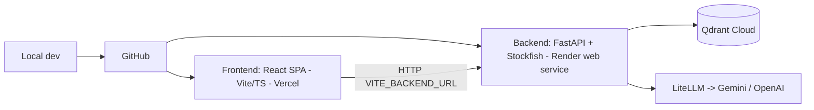

# Deployment topology

Referenced from [`ARCHITECTURE.md` §9](../ARCHITECTURE.md#9-deployment-topology-frontend--backend-are-separate-services).

```mermaid
flowchart LR
    Dev[Local dev] --> Repo[GitHub]
    Repo --> BE[Backend: FastAPI + Stockfish - Render web service]
    Repo --> FE[Frontend: React SPA - Vite/TS - Vercel]
    BE --> Qdrant[(Qdrant Cloud)]
    BE --> GW[LiteLLM -> Gemini / OpenAI]
    FE -- HTTP VITE_BACKEND_URL --> BE
```
