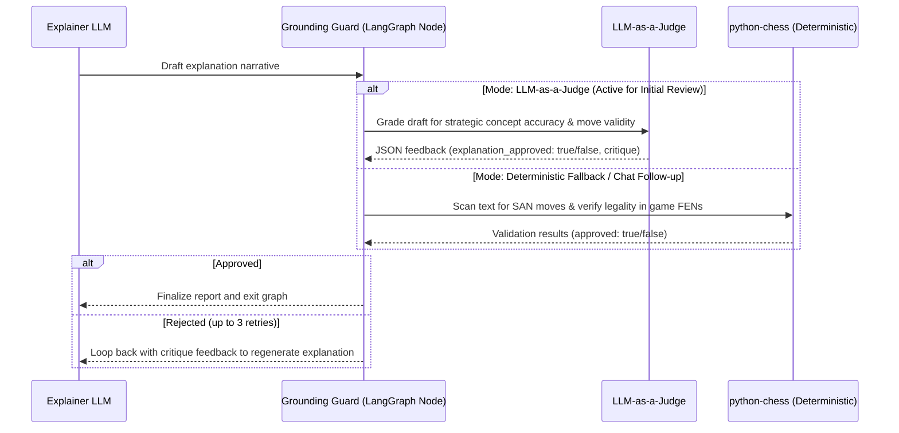

# Grounding guard sequence

Referenced from [`ARCHITECTURE.md` §8](../ARCHITECTURE.md#8-grounding-guard-anti-hallucination--semantic-validation).

```mermaid
sequenceDiagram
    participant E as Explainer LLM
    participant G as Grounding Guard (LangGraph Node)
    participant J as LLM-as-a-Judge
    participant C as python-chess (Deterministic)

    E->>G: Draft explanation narrative
    alt Mode: LLM-as-a-Judge (Active for Initial Review)
        G->>J: Grade draft for strategic concept accuracy & move validity
        J-->>G: JSON feedback (explanation_approved: true/false, critique)
    else Mode: Deterministic Fallback / Chat Follow-up
        G->>C: Scan text for SAN moves & verify legality in game FENs
        C-->>G: Validation results (approved: true/false)
    end

    alt Approved
        G-->>E: Finalize report and exit graph
    else Rejected (up to 3 retries)
        G-->>E: Loop back with critique feedback to regenerate explanation
    end
```
