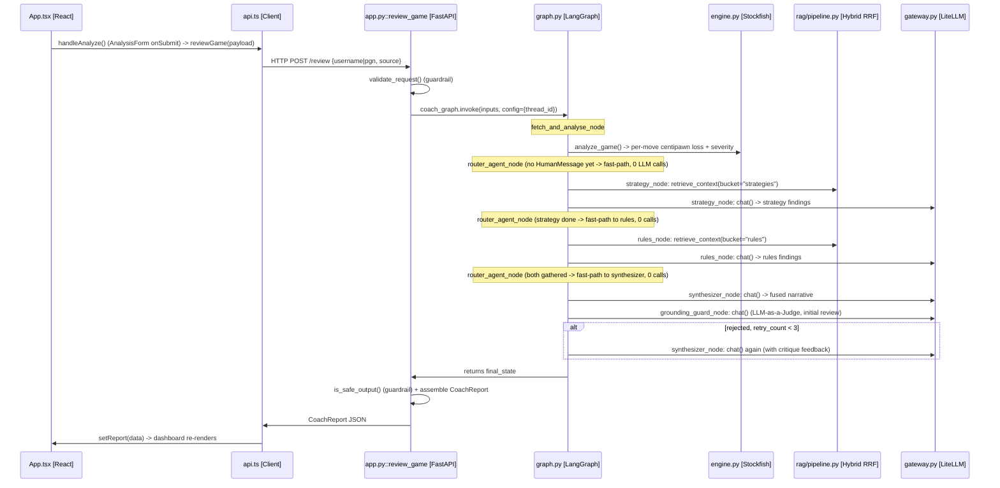

# Request lifecycle — end-to-end sequence

Copy of the diagrams inlined in [`ARCHITECTURE.md` §4a](../ARCHITECTURE.md#4a-request-lifecycle-end-to-end-sequence).

Traces a click in the browser all the way through the FastAPI route, the LangGraph
router/specialist/synthesizer team, Stockfish/RAG, and the LiteLLM gateway, back to the UI —
for both entry points the frontend calls. Node and file names match the current graph
(`backend/src/coach/agent/graph.py`), not the pre-Phase-9 single-agent version.

## Flow A: `POST /review` (initial game analysis)

Router LLM cost: **0 calls** — every routing decision is implied by state; only the
specialist/synthesis/guard nodes call the gateway.



## Flow B: `POST /chat` (follow-up question)

Router LLM cost: **1 call** — the first router visit does real intent classification; the
loop-back after the first specialist is a free, deterministic hop to the second one.

```mermaid
sequenceDiagram
    participant UI as App.tsx [React]
    participant Client as api.ts [Client]
    participant API as app.py::chat_message [FastAPI]
    participant Graph as graph.py [LangGraph]
    participant RAG as rag/pipeline.py [Hybrid RRF]
    participant GW as gateway.py [LiteLLM]

    UI->>Client: handleSendChat() (ChatPanel onSubmit) -> chatMessage(payload)
    Client->>API: HTTP POST /chat {message, session_id}
    API->>API: validate_request() (guardrail; off-topic -> short-circuit reply)
    API->>Graph: coach_graph.get_state(config={thread_id})
    alt no game loaded in this thread
        API->>Client: {"reply": "Please load and analyze a game first"} (no graph invoke)
    else game loaded
        API->>Graph: coach_graph.invoke({messages:[HumanMessage]}, config)
        Note over Graph: router_agent_node (HumanMessage, no findings yet -> 1 LLM call)
        Graph->>GW: router_agent_node: chat() -> classify "strategy" or "rules"
        Graph->>RAG: delegated specialist: retrieve_context(bucket=...)
        Graph->>GW: delegated specialist: chat() -> findings
        Note over Graph: router_agent_node (one specialist done -> fast-path to the other, 0 calls)
        Graph->>GW: second specialist: chat() -> findings
        Graph->>GW: synthesizer_node: chat() -> fused reply
        Note over Graph: grounding_guard_node forced to deterministic mode (chat follow-up)
        Graph->>API: returns final_state
        API->>API: extract last AIMessage as reply + rebuild DeveloperInsight
        API->>Client: {"reply": ..., "developer_insight": {...}}
    end
    Client->>UI: append reply to conversation
```
