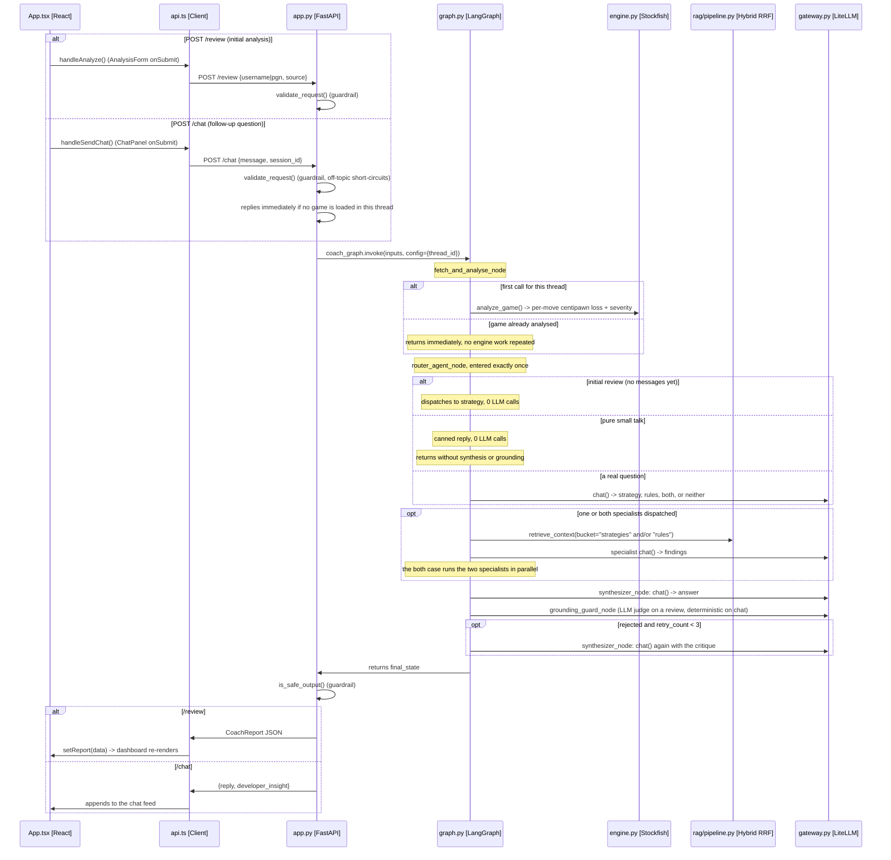

# Request lifecycle — end-to-end sequence

Copy of the diagrams inlined in [`ARCHITECTURE.md` §4a](../ARCHITECTURE.md#4a-request-lifecycle-end-to-end-sequence).

Traces a click in the browser through the FastAPI route, the LangGraph
router/specialist/synthesizer team, Stockfish and retrieval, and the LiteLLM gateway, back to the
UI. Both entry points the frontend calls run the same graph, so they are shown as one sequence.
Node and file names match `backend/src/coach/agent/graph.py`.

**Both entry points run the same graph.** `/review` starts a thread and `/chat` continues it; the
difference is what the router finds in state, not a different pipeline. Router LLM cost is **0
calls** on a review (dispatch is implied by state), **1 call** on a real question, and **0** for
pure small talk.

