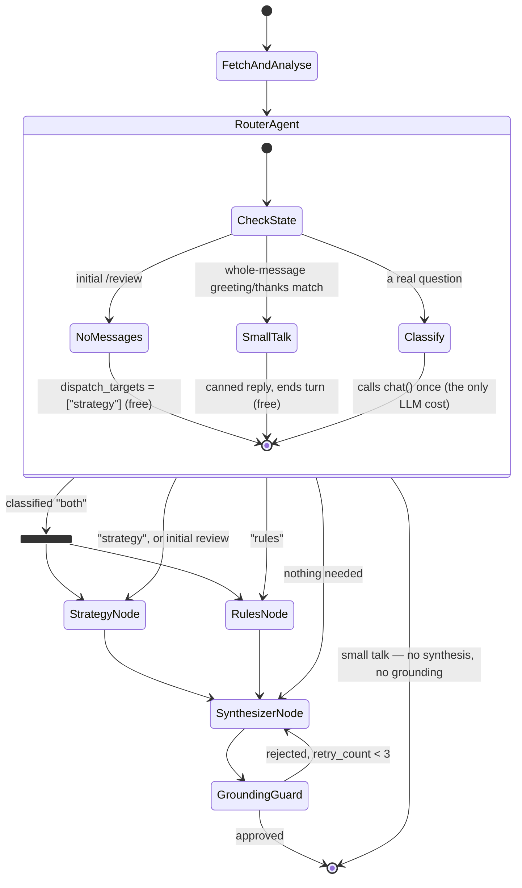

# Router dispatch — how the router decides

Referenced from [`ARCHITECTURE.md` §4](../ARCHITECTURE.md#4-agent-workflow-control-flow) and
[`Deliverables.md` §6.3](../Deliverables.md#63-iterative-improvements--engineering-optimizations).

`router_agent_node` is entered **exactly once per graph invocation**. It decides the whole turn in
that single visit: run one specialist, run both in parallel, run neither, or answer small talk from
a template and end the turn. Nothing loops back to the router.

## Decision table

| Turn | `dispatch_targets` | Router LLM call |
|---|---|---|
| Initial `/review` (no messages) | `["strategy"]` | none |
| Pure small talk ("hi", "thanks", "bye") | `["end"]` — canned reply, ends the turn | none |
| Chat, strategy question | `["strategy"]` | 1 |
| Chat, rules question | `["rules"]` | 1 |
| Chat, needs both | `["strategy", "rules"]` — parallel fan-out | 1 |
| Chat, neither specialist needed | `[]` — straight to synthesis | 1 |

Rules deliberately does not run on a plain review: there is no rules question to answer there.

## Control flow

## Why one-shot dispatch

The earlier design let specialists loop back into the router so it could sequence them, which meant
the router was a repeat visitor within a single turn and needed state to track "what is left to
run". Deciding everything up front removes that bookkeeping, and makes the "both" case a genuine
parallel fan-out: both specialists run in one superstep, and because each has a fixed edge to
`synthesizer_node`, LangGraph runs the synthesizer once after both finish — standard fan-in, no
custom join code.

Because both specialists can now write state in the same superstep, every key either of them writes
must be `Annotated` with a reducer, or LangGraph raises `InvalidUpdateError: can receive only one
value per step`. That is why `rag_context` has a `merge_rag_context` reducer.

## Small talk costs nothing

A message that is *purely* a greeting, thanks, or farewell is matched against a deterministic
allowlist and answered from a template: no LLM call, no specialist, no synthesizer, and no grounding
guard — a canned reply names no moves, so there is nothing to legality-check.

Matching is **whole-message**, not prefix. `"Hi, why was my move a blunder?"` merely opens politely
and still reaches normal classification; silently swallowing such questions would break coaching,
and a regression test covers it.

## History

Phase 9 introduced a five-branch fast-path table and the specialist loop-back, documented in
[`final_docs/implementation/phase9.md`](../../final_docs/implementation/phase9.md). Phase 10
replaced it after tracing a defect that made the specialist layer inert on `/review` entirely — see
[`final_docs/implementation/phase10.md`](../../final_docs/implementation/phase10.md).
