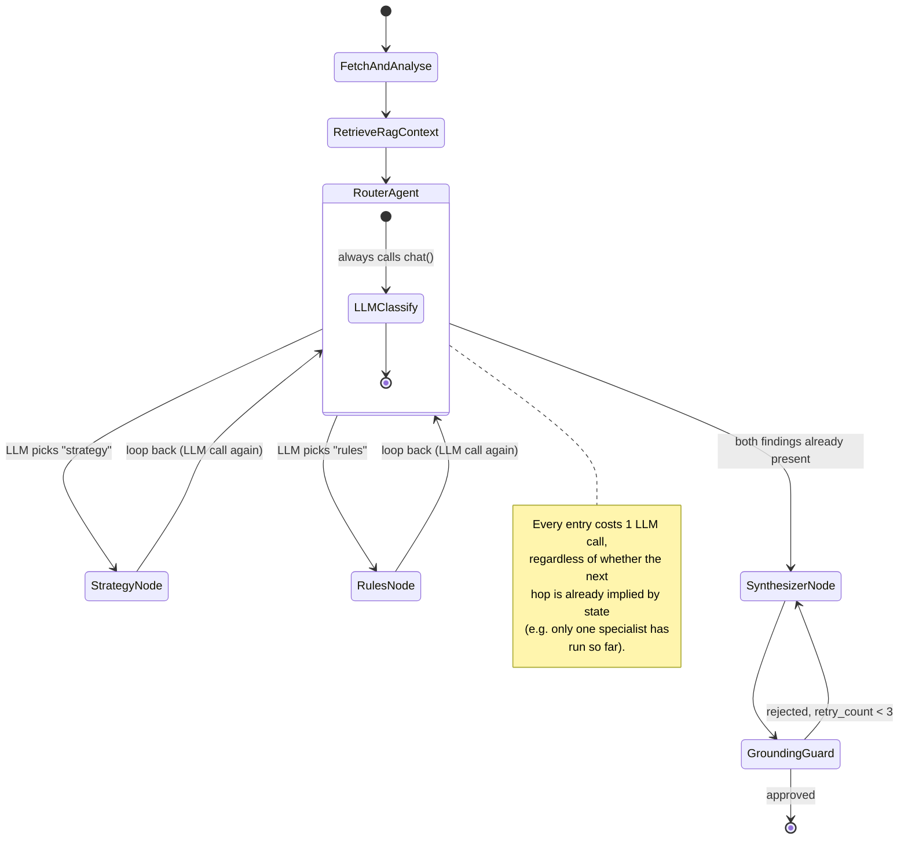
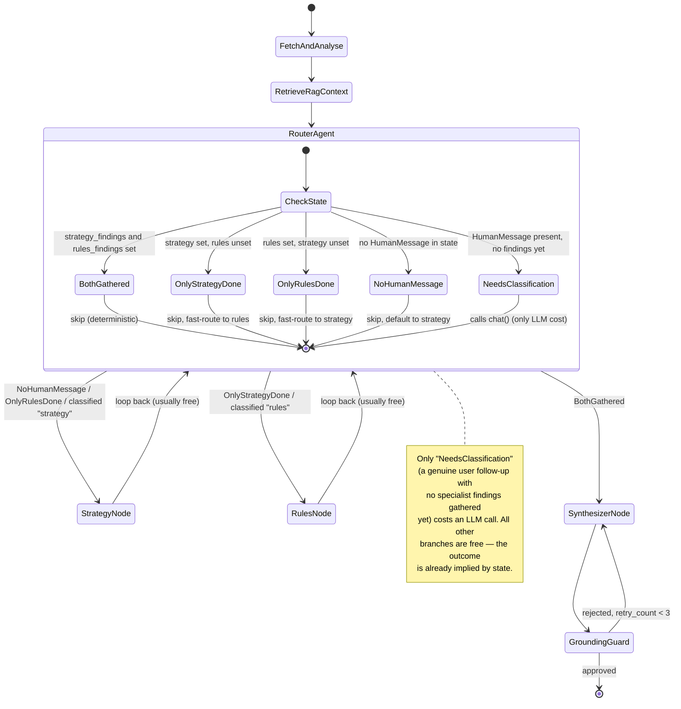

# Router fast-pathing — before/after

Referenced from [`ARCHITECTURE.md` §4](../ARCHITECTURE.md#4-agent-workflow-control-flow) and
[`Deliverables.md` §6.3](../Deliverables.md#63-iterative-improvements--engineering-optimizations).

## Before: Router always calls the LLM

Every visit to `router_agent` — whether it's the first pass on an initial review, or a
loop-back after a specialist finishes — invokes the classification LLM call, even when
the next step is already deterministic given current state.

## After: Router short-circuits on known state

`router_agent_node` now inspects `strategy_findings` / `rules_findings` /
whether any `HumanMessage` exists *before* calling the LLM. Three of its four branches
return deterministically with zero LLM cost; only the "user asked something new, no
findings yet" branch reaches the `chat()` call.

## Net effect

- **Initial review** (`/review`, no `HumanMessage`): both specialists (strategy + rules) now run for
  full coverage, yet the router itself never costs an LLM call — the decisions that used to require
  one classification call are now made for free from state.
- **Chat follow-up** (`/chat`): the first router visit still needs the LLM (real intent
  classification), but the loop-back after the first specialist completes is now a free,
  deterministic hop to the other specialist instead of a second classification call.
- Total LLM calls per turn drop by 1 in both flows, with no loss of specialist coverage.
