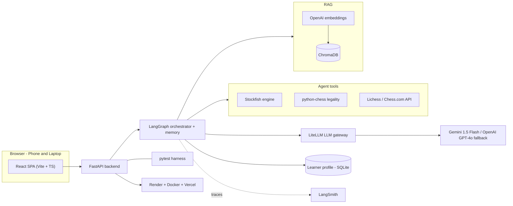

# System infrastructure architecture

Referenced from [`Deliverables.md` §2.2](../Deliverables.md#22-system-infrastructure-architecture).

```mermaid
flowchart LR
    subgraph Client["Browser - Phone and Laptop"]
      UI["React SPA (Vite + TS)"]
    end
    UI --> API["FastAPI backend"]
    API --> ORCH["LangGraph orchestrator + memory"]
    ORCH --> GW["LiteLLM LLM gateway"]
    GW --> LLM["Gemini 1.5 Flash / OpenAI GPT-4o fallback"]
    ORCH --> MEM[("Learner profile - SQLite")]
    subgraph TOOLS["Agent tools"]
      SF["Stockfish engine"]
      PC["python-chess legality"]
      LI["Lichess / Chess.com API"]
    end
    ORCH --> TOOLS
    subgraph RAGSYS["RAG"]
      EMB["OpenAI embeddings"] --> VDB[("ChromaDB")]
    end
    ORCH --> RAGSYS
    ORCH -. "traces" .-> MON["LangSmith"]
    API --- EVAL["pytest harness"]
    API --> DEP["Render + Docker + Vercel"]
```
