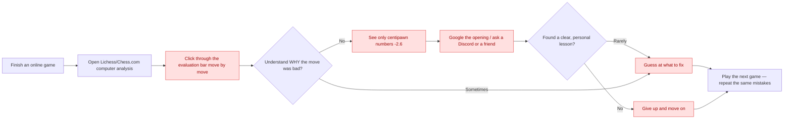

# Current user workflow & bottlenecks

Referenced from [`Deliverables.md` §1.4](../Deliverables.md#14-current-workflow--bottlenecks).

```mermaid
flowchart LR
    A[Finish an online game] --> B["Open Lichess/Chess.com computer analysis"]
    B --> C[Click through the evaluation bar move by move]
    C --> D{Understand WHY the move was bad?}
    D -- No --> E[See only centipawn numbers -2.6]
    E --> F["Google the opening / ask a Discord or a friend"]
    F --> G{Found a clear, personal lesson?}
    G -- Rarely --> H[Guess at what to fix]
    G -- No --> I[Give up and move on]
    D -- Sometimes --> H
    H --> J[Play the next game — repeat the same mistakes]
    I --> J
    classDef pain fill:#ffe0e0,stroke:#d33,color:#900;
    class C,E,F,H,I pain
```
